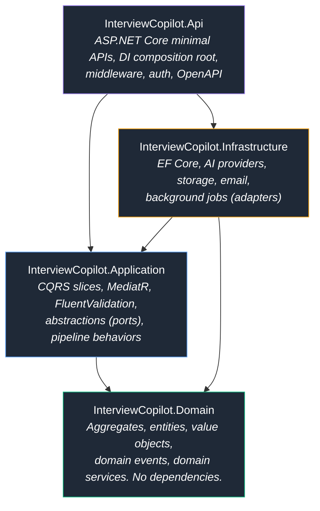
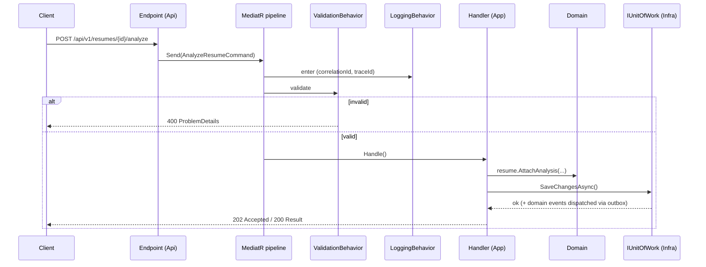
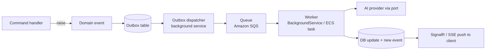

# System Architecture

> **Document 01 of 16** · Depends on: [00-overview](00-overview.md) · Related: [02-c4-diagrams](02-c4-diagrams.md), [03-domain-model](03-domain-model.md)

This document defines the macro structure of the backend, the way features are organized, the engineering standards every contributor follows, and the cross-cutting concerns wired through the request pipeline.

---

## 1. Architectural style

Interview Copilot AI uses **Clean Architecture for boundaries** and **Vertical Slice Architecture for features**, with **CQRS** as the request model. These are complementary, not competing:

- Clean Architecture answers *"what can depend on what"* — the dependency rule points inward, the domain is pure, infrastructure is replaceable.
- Vertical Slice Architecture answers *"how do I organize a feature"* — a use case lives in one folder with its command/query, handler, validator, and response, instead of being smeared across `Controllers/`, `Services/`, `Repositories/`.
- CQRS answers *"how do reads and writes differ"* — commands mutate state and emit events; queries are read-optimized projections that may bypass the domain entirely.

### Why this combination

A pure layered architecture tends to grow "god services" and forces a developer touching one feature to navigate five horizontal folders. Pure vertical slices, without Clean boundaries, let infrastructure leak into business logic. Combining them gives us: testable, dependency-free business rules **and** features that are cohesive and independently evolvable. This directly serves requirement 14 (maintainability) and 15 (DDD).

## 2. The four projects



**The dependency rule:** arrows point toward the domain. `Domain` references nothing. `Application` references only `Domain`. `Infrastructure` and `Api` reference inward. `Application` defines *ports* (interfaces like `IChatCompletionService`, `IResumeRepository`, `IUnitOfWork`); `Infrastructure` provides *adapters* (the EF Core / OpenAI implementations). `Api` is the composition root that wires ports to adapters at startup.

### Project responsibilities

| Project | Contains | Must NOT contain |
|---|---|---|
| **Domain** | Aggregates, entities, value objects, domain events, domain exceptions, invariants, domain services | EF Core, MediatR, HTTP, JSON, any NuGet beyond BCL |
| **Application** | Commands/queries, handlers, validators, DTOs, port interfaces, pipeline behaviors, mapping | Concrete DB/AI/HTTP implementations |
| **Infrastructure** | EF Core `DbContext` + configs, AI provider clients, S3 storage, background workers, outbox dispatcher | Business rules, validation logic |
| **Api** | Endpoint definitions, middleware, auth, DI wiring, OpenAPI, health checks | Business logic, data access |

## 3. Vertical slice anatomy

Every use case is a folder under `Application/Features/<Context>/<UseCase>/`. A slice for analyzing a resume:

```
Application/Features/Resumes/AnalyzeResume/
├── AnalyzeResumeCommand.cs        # IRequest<Result<ResumeAnalysisResponse>>
├── AnalyzeResumeHandler.cs        # IRequestHandler — orchestrates domain + ports
├── AnalyzeResumeValidator.cs      # FluentValidation rules
├── ResumeAnalysisResponse.cs      # response DTO
└── AnalyzeResumeEndpoint.cs       # maps route -> sends command (optional, can live in Api)
```

The handler depends only on Application ports and Domain types. It loads/creates an aggregate, calls domain behavior, persists through `IUnitOfWork`, and returns a `Result<T>`. No try/catch-for-flow, no infrastructure types.



## 4. Request pipeline (cross-cutting via MediatR behaviors)

Cross-cutting concerns are implemented once as ordered pipeline behaviors, not duplicated per handler:

1. **`RequestLoggingBehavior`** — structured start/stop logs with correlation + trace IDs, request name, elapsed ms.
2. **`ValidationBehavior`** — runs all FluentValidators for the request; short-circuits to a typed validation failure on error.
3. **`AuthorizationBehavior`** — checks resource-level permissions (does this candidate own this resume?).
4. **`UnitOfWorkBehavior`** — wraps command handlers in a transaction; commits on success and triggers the outbox.
5. **`PerformanceBehavior`** — flags handlers exceeding a latency threshold to the metrics pipeline.
6. **`CachingBehavior`** (queries only) — short-TTL response caching for idempotent reads.

## 5. Background processing & domain events

Ingestion and AI generation are long-running and must not block HTTP requests. The flow:



- **Transactional outbox** guarantees that a domain event is persisted in the same transaction as the state change, then reliably dispatched (no lost events, at-least-once delivery).
- **Idempotency keys** on workers make at-least-once safe.
- **Status model**: artifacts move `Pending → Processing → Completed | Failed`; the client subscribes for live updates (see Doc 05 §realtime).

## 6. Folder structure (repository root)

```
interview-copilot/
├── README.md
├── DESIGN.md
├── docs/                          # this architecture suite (16 docs)
├── backend/
│   ├── InterviewCopilot.sln
│   ├── global.json                # pins .NET 10 SDK
│   ├── Directory.Build.props      # shared MSBuild: nullable, analyzers, langversion
│   ├── Directory.Packages.props   # central package management (CPM)
│   ├── .editorconfig              # formatting + analyzer severities
│   ├── src/
│   │   ├── InterviewCopilot.Domain/
│   │   │   ├── Common/            # AggregateRoot, Entity, ValueObject, Result, DomainEvent
│   │   │   ├── Companies/         # CompanyAnalysis aggregate + VOs + events
│   │   │   ├── Resumes/
│   │   │   ├── JobDescriptions/
│   │   │   ├── Preparations/
│   │   │   └── MockInterviews/
│   │   ├── InterviewCopilot.Application/
│   │   │   ├── Common/Behaviors/  # MediatR pipeline behaviors
│   │   │   ├── Common/Messaging/  # ICommand, IQuery markers
│   │   │   ├── Abstractions/      # ports: AI, storage, persistence, clock, user
│   │   │   └── Features/<Ctx>/<UseCase>/   # vertical slices
│   │   ├── InterviewCopilot.Infrastructure/
│   │   │   ├── Persistence/       # DbContext, configs, migrations, repositories, outbox
│   │   │   ├── Ai/                # provider clients, router, factory, tokenizer
│   │   │   ├── Storage/           # S3 blob store
│   │   │   ├── Ingestion/         # PDF/DOCX/image/URL extractors
│   │   │   └── DependencyInjection.cs
│   │   └── InterviewCopilot.Api/
│   │       ├── Program.cs
│   │       ├── Endpoints/         # endpoint groups per context
│   │       ├── Middleware/        # exception handling, correlation
│   │       └── appsettings*.json
│   └── tests/
│       ├── Domain.UnitTests/
│       ├── Application.UnitTests/
│       ├── Architecture.Tests/    # enforce dependency rules
│       └── Api.IntegrationTests/  # Testcontainers (Postgres)
├── frontend/                      # Next.js app (Doc 06)
├── infra/                         # Docker + Terraform (Docs 08–09)
└── .github/workflows/             # CI/CD pipelines (Doc 09)
```

## 7. Engineering standards (requirement 13)

**Language & compiler.** C# 14 / .NET 10. `Nullable` enabled solution-wide. `TreatWarningsAsErrors=true` in CI. `ImplicitUsings` enabled. `LangVersion=latest`.

**Analyzers.** Microsoft.CodeAnalysis.NetAnalyzers + a curated ruleset in `.editorconfig`; SonarAnalyzer for code smells; analyzer violations fail the build.

**Central Package Management.** All versions declared once in `Directory.Packages.props`; projects reference packages without versions. Renovate/Dependabot keeps them current.

**Immutability & expressiveness.** Value objects and DTOs are `record` types. Domain entities expose behavior, not public setters (encapsulated invariants). Prefer `required` members and primary constructors.

**Error handling.** Business outcomes use a `Result<T>` type (no exceptions for control flow). Exceptions are reserved for truly exceptional faults and are translated to RFC 9457 `ProblemDetails` by a global exception handler. Every error has a stable machine-readable `code`.

**Naming & structure.** One public type per file. Slices named by intent (`AnalyzeResume`, not `ResumeService`). Async methods suffixed `Async` and accept `CancellationToken`.

**Testing.** Domain logic = pure unit tests. Application slices = handler tests with fakes for ports. Architecture tests (NetArchTest) assert the dependency rule and naming conventions in CI. Integration tests run against real Postgres via Testcontainers. Coverage gate: 80% on Domain + Application.

**Formatting.** `dotnet format` enforced in CI; `.editorconfig` is the single source of truth.

**Documentation.** Public ports and domain types carry XML docs. Every slice's command documents its contract. ADRs (see `engineering:architecture` skill format) capture significant decisions in `docs/adr/`.

## 8. Configuration & secrets

- Strongly-typed `IOptions<T>` for every config section, validated at startup (`ValidateOnStart`).
- No secrets in source. Local dev uses `.NET user-secrets`; deployed environments use **AWS Secrets Manager** + **SSM Parameter Store**, injected as environment variables by ECS task definitions.
- Feature flags via a lightweight provider (e.g. config-backed initially, swappable for a managed flag service) gate risky features (mock interview, new providers).

## 9. How the architecture serves the non-functional goals

| Goal | Mechanism |
|---|---|
| **Maintainability** | Vertical slices, dependency rule, architecture tests, CPM |
| **Scalability** | Stateless API, background workers, queue-based decoupling, read replicas |
| **Observability** | OTel tracing + Serilog + metrics behaviors (Doc 11) |
| **AI cost optimization** | Provider abstraction + model router + caching + token accounting (Doc 07, 14) |
| **Security** | Authorization behavior, tenant scoping, encrypted storage (Doc 10) |
