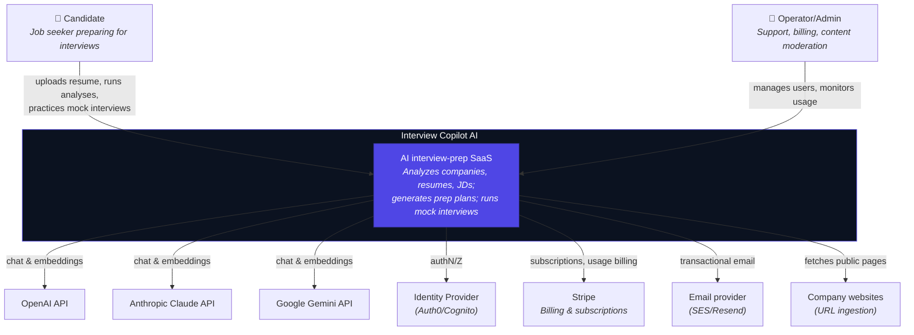
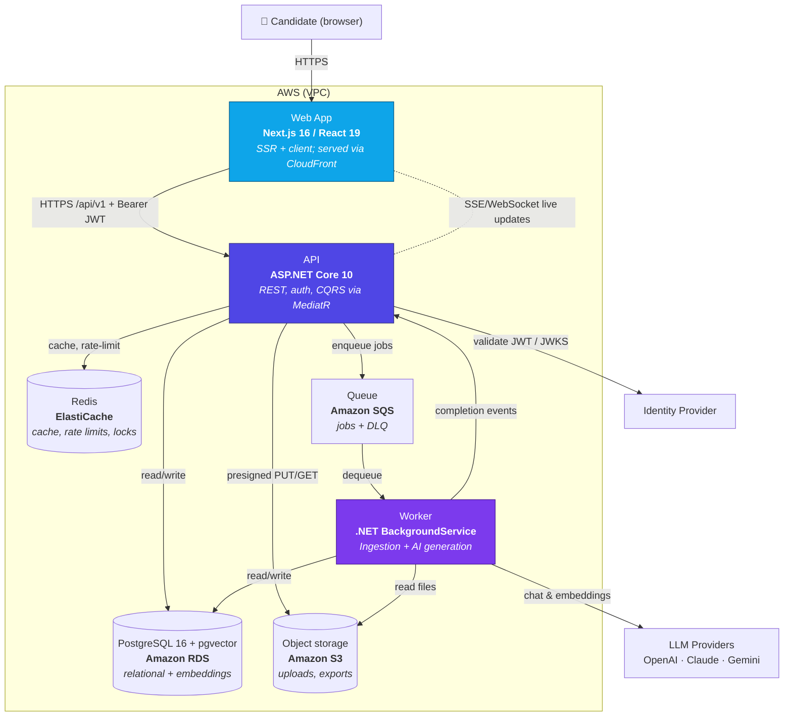
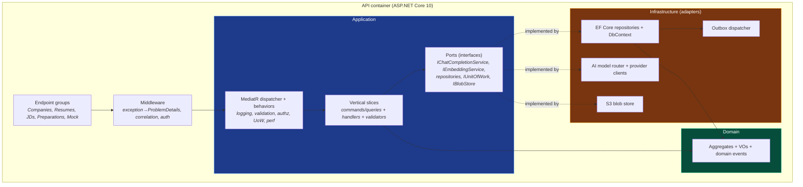
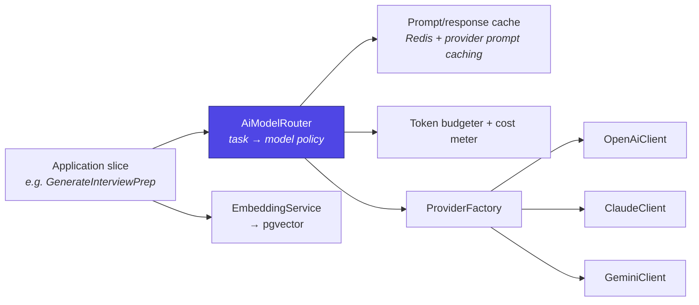
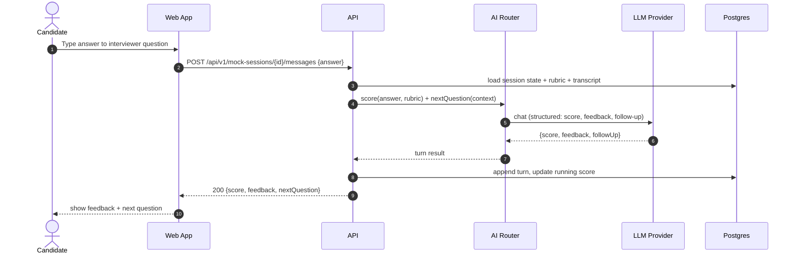

# C4 Architecture Diagrams

> **Document 02 of 16** · Depends on: [01-system-architecture](01-system-architecture.md)

This document presents the system using the [C4 model](https://c4model.com): System Context (Level 1), Containers (Level 2), Components (Level 3), plus key dynamic diagrams. All diagrams are Mermaid and render on GitHub.

---

## Level 1 — System Context

Who and what interacts with Interview Copilot AI.



## Level 2 — Container Diagram

The runnable/deployable units and their conversations.



**Container responsibilities**

| Container | Tech | Responsibility | Scaling |
|---|---|---|---|
| Web App | Next.js 16 | UI, SSR, auth session, data fetching | CloudFront + Fargate/edge |
| API | ASP.NET Core 10 | Synchronous request handling, validation, authz, enqueue | Horizontal (stateless) on ECS Fargate |
| Worker | .NET worker | Async ingestion + AI generation | Horizontal by SQS depth |
| PostgreSQL | RDS + pgvector | System of record + vector search | Vertical + read replicas |
| Redis | ElastiCache | Cache, rate limiting, distributed locks | Cluster mode |
| SQS | SQS + DLQ | Durable job buffer | Managed |
| S3 | S3 | Document blobs, exports | Managed |

## Level 3 — Component Diagram (API container)

Inside the ASP.NET Core API, mapped to the Clean + Vertical Slice layers.



## Level 3 — Component Diagram (AI subsystem)

The provider-agnostic AI layer (detailed in Doc 07).



## Dynamic — Company Analysis from a URL

```mermaid
sequenceDiagram
    autonumber
    actor U as Candidate
    participant W as Web App
    participant A as API
    participant Q as SQS
    participant K as Worker
    participant I as Ingestion
    participant R as AI Router
    participant P as LLM Provider
    participant D as Postgres+pgvector

    U->>W: Submit company URL
    W->>A: POST /api/v1/companies/analyses {sourceType:url}
    A->>D: insert CompanyAnalysis (status=Pending)
    A->>Q: enqueue AnalyzeCompanyJob(id)
    A-->>W: 202 Accepted {id, status:Pending}
    W-->>U: show "Analyzing…" with live updates
    Q->>K: deliver job
    K->>I: fetch + clean page text
    K->>R: structure(company text, task=company_overview)
    R->>P: chat completion (cheapest qualifying model)
    P-->>R: structured sections
    R-->>K: CompanyAnalysisResult
    K->>D: upsert sections + embeddings; status=Completed
    K->>A: publish completion event
    A-->>W: SSE: analysis.completed {id}
    W-->>U: render company report
```

## Dynamic — AI Mock Interview turn



## Deployment view (preview)

Full topology, IaC, and environments are in [08-deployment-architecture](08-deployment-architecture.md). At a glance: CloudFront → ALB → ECS Fargate services (api, worker) in private subnets → RDS, ElastiCache, SQS, S3, Secrets Manager, all inside one VPC across two AZs.
