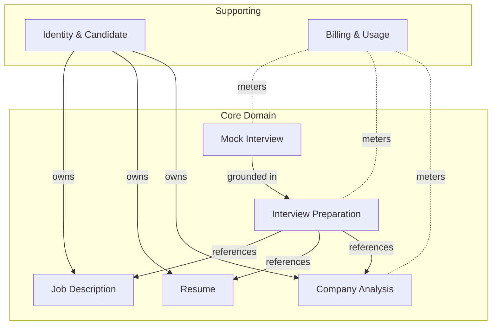
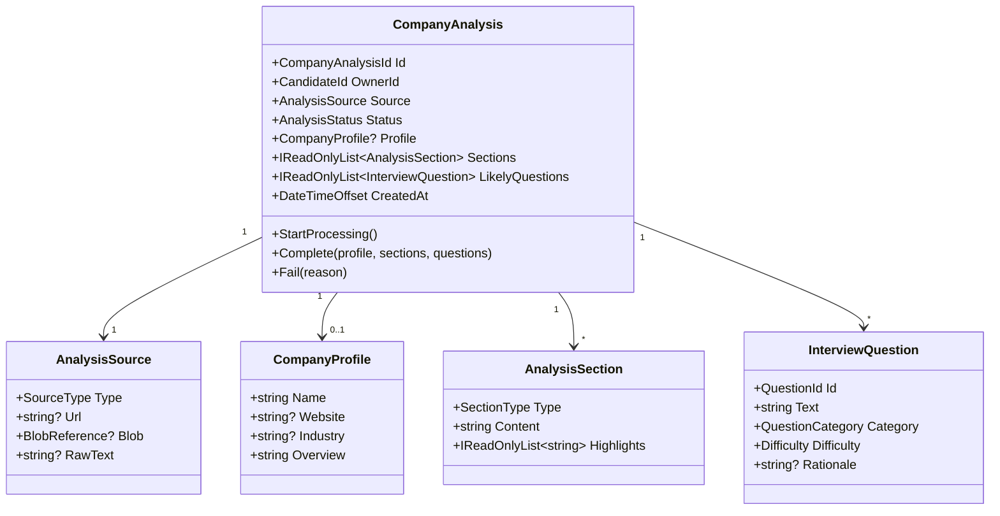
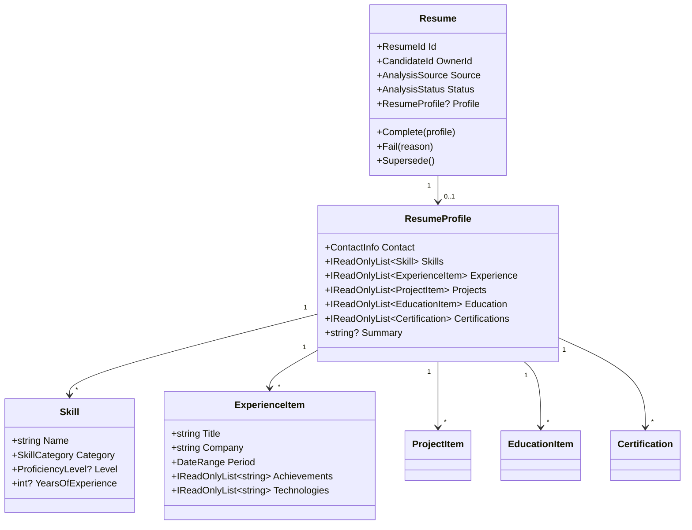
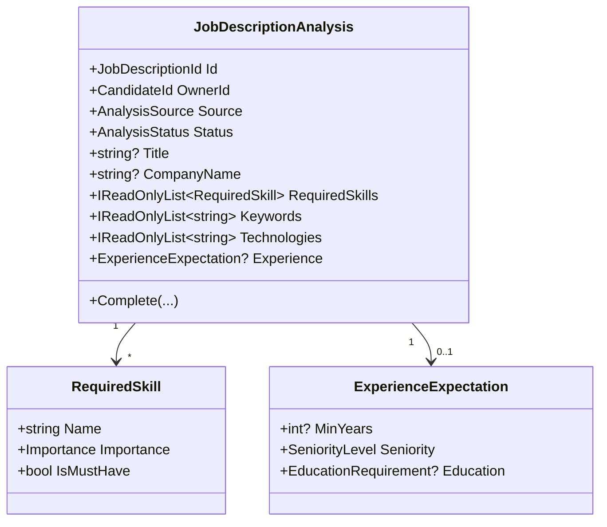
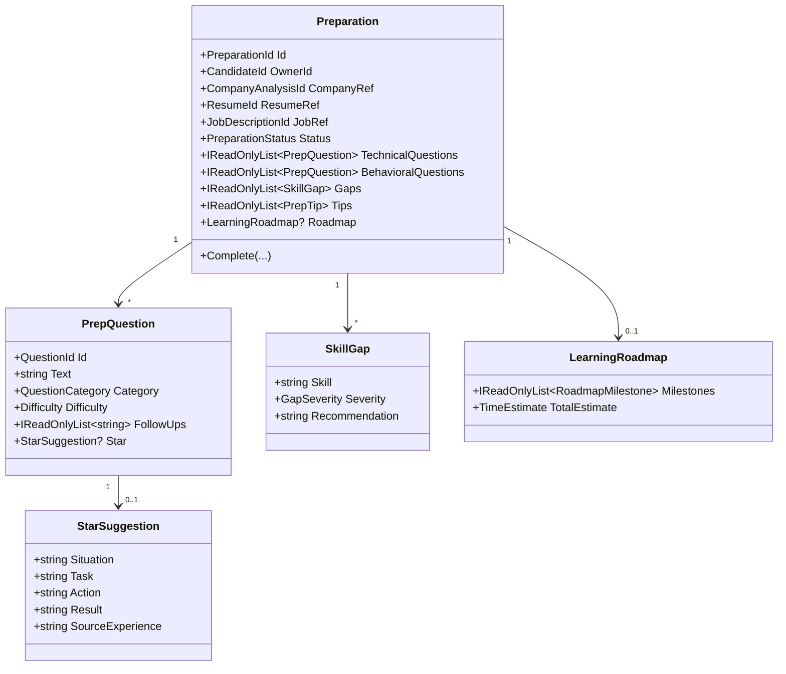
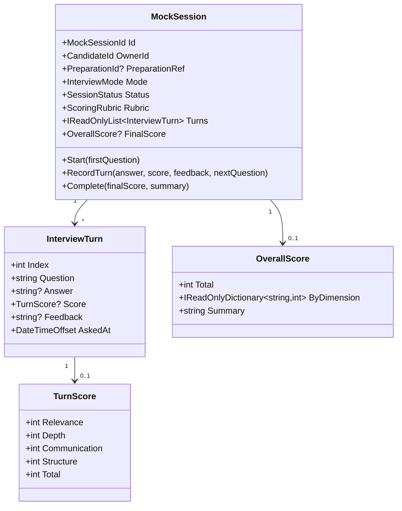
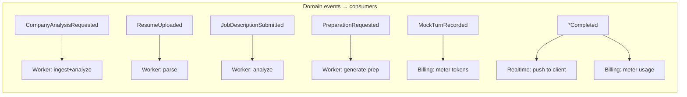

# Domain Model

> **Document 03 of 16** · Depends on: [01-system-architecture](01-system-architecture.md) · Implements requirement 3 & 15 (DDD)

This document models the business using DDD tactical patterns: bounded contexts, aggregates, entities, value objects, domain events, and invariants. The Domain project is dependency-free; everything here maps directly to C# types in `backend/src/InterviewCopilot.Domain/`.

---

## 1. Bounded contexts

The platform decomposes into six contexts. Identity is a supporting context (delegated to the IdP); the five feature contexts carry the core domain.

**Context map relationships.** Identity is upstream of all feature contexts (Customer–Supplier; feature contexts conform to its `CandidateId`). Preparation is a *downstream consumer* of Company/Resume/JD via published-language references (it stores their IDs and snapshots, not their internals). Mock Interview is grounded in a Preparation. Billing is a separate context that *observes* domain events to meter usage (no inward coupling).

## 2. Ubiquitous language

| Term | Meaning |
|---|---|
| **Candidate** | The authenticated user who owns analyses and preparations |
| **Analysis** | A generated structured artifact (company/resume/JD) with a lifecycle status |
| **Source** | The raw input to an analysis (URL/PDF/DOCX/image/text) |
| **Section** | A typed slice of a company analysis (overview, culture, etc.) |
| **Preparation** | The fused plan from a company + resume + JD |
| **Gap** | A required-skill the candidate's resume does not evidence |
| **STAR suggestion** | A Situation-Task-Action-Result scaffold for a behavioral answer |
| **Mock session** | A stateful interview conversation with scoring |
| **Turn** | One question/answer/score exchange in a mock session |

## 3. Building blocks (Domain/Common)

The shared tactical primitives every aggregate uses:

- `Entity<TId>` — identity equality, holds a list of raised domain events.
- `AggregateRoot<TId>` — an `Entity` that is a consistency + transaction boundary.
- `ValueObject` — structural equality, immutable.
- `IDomainEvent` — a record of something that happened (past tense).
- `Result` / `Result<T>` — explicit success/failure with an `Error(code, message)`; the domain never throws for expected business outcomes.
- `StronglyTypedId` — `record struct` IDs (`CandidateId`, `ResumeId`, …) to prevent primitive-obsession bugs.

## 4. Aggregates

### 4.1 Company Analysis (aggregate root: `CompanyAnalysis`)

- **`SectionType`**: `Overview, ProductsServices, ClientsIndustries, Culture, Locations, HiringProcess, InterviewStyle`.
- **Invariants**: cannot `Complete` unless `Status == Processing`; a completed analysis must have a `Profile` and at least the `Overview` section. Status transitions are guarded: `Pending → Processing → (Completed | Failed)` only.
- **Events**: `CompanyAnalysisRequested`, `CompanyAnalysisCompleted`, `CompanyAnalysisFailed`.

### 4.2 Resume (aggregate root: `Resume`)

- **Invariants**: a candidate may have many resumes but exactly one `IsCurrent`. `Supersede()` flips the current pointer atomically (enforced at application level via unique partial index, Doc 04).
- **Events**: `ResumeUploaded`, `ResumeParsed`, `ResumeParseFailed`.

### 4.3 Job Description (aggregate root: `JobDescriptionAnalysis`)

- Gap analysis is **not** stored on the JD; it is computed when a Preparation fuses a JD with a Resume (gaps depend on both). This keeps the JD aggregate cohesive.
- **Events**: `JobDescriptionSubmitted`, `JobDescriptionAnalyzed`.

### 4.4 Interview Preparation (aggregate root: `Preparation`)

The fusion aggregate. It references the three inputs by ID and snapshots the inputs it used (so a later edit to a resume does not silently change a generated prep).

- **Invariants**: all three referenced artifacts must belong to the same `OwnerId` and be in `Completed` status before a Preparation can be requested (checked in the slice/domain service `PreparationFactory`).
- **Events**: `PreparationRequested`, `PreparationCompleted`, `PreparationFailed`.

### 4.5 Mock Interview (aggregate root: `MockSession`)

- **`InterviewMode`**: `Technical, Behavioral, Mixed, SystemDesign`.
- **Invariants**: turns are append-only and strictly ordered; you cannot `RecordTurn` on a `Completed` session; `FinalScore` is set exactly once at completion.
- **Events**: `MockSessionStarted`, `MockTurnRecorded`, `MockSessionCompleted`.

## 5. Shared value objects

| Value object | Notes |
|---|---|
| `AnalysisSource` | Discriminated by `SourceType` (Url/Pdf/Docx/Image/Text); validates exactly one payload is set |
| `BlobReference` | S3 bucket + key + content type + checksum |
| `DateRange` | Start/optional end; rejects end-before-start |
| `AnalysisStatus` / `*Status` | Enums with guarded transitions |
| `Difficulty`, `Importance`, `GapSeverity`, `SeniorityLevel` | Bounded enums |
| `TokenUsage` | Prompt/completion/total tokens + provider + model + cost (for metering) |

## 6. Domain events catalogue

All events flow through the **transactional outbox** (Doc 01 §5): persisted in the same transaction as the aggregate change, then dispatched at-least-once to handlers and the queue.

## 7. Domain services

Logic that doesn't belong to a single aggregate:

- **`PreparationFactory`** — validates that the three inputs are owned, completed, and coherent, then constructs the `Preparation` request.
- **`GapAnalyzer`** — pure function comparing `RequiredSkill[]` (JD) against `Skill[]` + `ExperienceItem[]` (resume) to produce `SkillGap[]`. Deterministic, unit-tested, AI-augmented only for phrasing recommendations.
- **`MockScoringPolicy`** — encapsulates how a `TurnScore` rolls up into an `OverallScore`.
