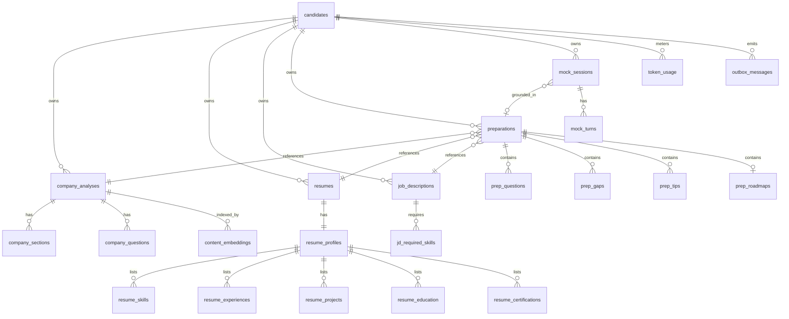

# Database Design

> **Document 04 of 16** · Depends on: [03-domain-model](03-domain-model.md) · Implements requirement 4

PostgreSQL 16 is the system of record; the **pgvector** extension provides semantic search over analysis content. This document gives the ERD, DDL, indexing strategy, vector design, and migration approach. EF Core 10 owns the schema via code-first migrations.

---

## 1. Design principles

- **Aggregate = transactional boundary.** Each aggregate root maps to a primary table; child collections (sections, turns, skills) are owned tables with cascade delete and no independent identity outside their root.
- **One schema, soft multi-tenancy by `owner_id`.** Every owned row carries `owner_id` (the candidate). A global EF Core query filter scopes all reads to the current candidate; cross-tenant access is structurally impossible from the application path.
- **JSONB for AI-shaped, query-light payloads; columns for queryable facts.** Rich nested model output (e.g., a STAR suggestion) is stored as `jsonb`; anything filtered/sorted/joined gets real columns.
- **UUID v7 primary keys** for time-ordered, index-friendly, non-enumerable IDs.
- **Append-only where natural** (mock turns, token usage, outbox) for auditability.
- **Timestamps in UTC** (`timestamptz`), `created_at`/`updated_at` on every table.

## 2. Entity-Relationship Diagram



## 3. Core DDL

> Shown as target SQL; in the repo this is produced by EF Core migrations (Doc §6). Abbreviated `created_at`/`updated_at`/`owner_id` columns are present on all owned tables.

```sql
CREATE EXTENSION IF NOT EXISTS vector;        -- pgvector
CREATE EXTENSION IF NOT EXISTS pg_trgm;       -- fuzzy keyword search

-- ---------- Identity ----------
CREATE TABLE candidates (
    id              uuid PRIMARY KEY,             -- maps to IdP subject
    email           citext UNIQUE NOT NULL,
    display_name    text,
    plan            text NOT NULL DEFAULT 'free', -- free|pro|team
    created_at      timestamptz NOT NULL DEFAULT now(),
    updated_at      timestamptz NOT NULL DEFAULT now()
);

-- ---------- Company Analysis ----------
CREATE TABLE company_analyses (
    id              uuid PRIMARY KEY,
    owner_id        uuid NOT NULL REFERENCES candidates(id) ON DELETE CASCADE,
    source_type     text NOT NULL,               -- url|pdf|docx|image|text
    source_url      text,
    source_blob_key text,
    status          text NOT NULL DEFAULT 'pending',
    company_name    text,
    industry        text,
    profile         jsonb,                        -- CompanyProfile
    error           text,
    created_at      timestamptz NOT NULL DEFAULT now(),
    updated_at      timestamptz NOT NULL DEFAULT now(),
    completed_at    timestamptz
);

CREATE TABLE company_sections (
    id              uuid PRIMARY KEY,
    analysis_id     uuid NOT NULL REFERENCES company_analyses(id) ON DELETE CASCADE,
    section_type    text NOT NULL,                -- overview|culture|...
    content         text NOT NULL,
    highlights      jsonb NOT NULL DEFAULT '[]',
    ordinal         int  NOT NULL
);

CREATE TABLE company_questions (
    id              uuid PRIMARY KEY,
    analysis_id     uuid NOT NULL REFERENCES company_analyses(id) ON DELETE CASCADE,
    text            text NOT NULL,
    category        text NOT NULL,                -- technical|behavioral|...
    difficulty      text NOT NULL,
    rationale       text
);

-- ---------- Resume ----------
CREATE TABLE resumes (
    id              uuid PRIMARY KEY,
    owner_id        uuid NOT NULL REFERENCES candidates(id) ON DELETE CASCADE,
    source_type     text NOT NULL,
    source_blob_key text,
    status          text NOT NULL DEFAULT 'pending',
    is_current      boolean NOT NULL DEFAULT false,
    error           text,
    created_at      timestamptz NOT NULL DEFAULT now(),
    updated_at      timestamptz NOT NULL DEFAULT now()
);
-- exactly one current resume per candidate:
CREATE UNIQUE INDEX ux_resumes_one_current
    ON resumes(owner_id) WHERE is_current;

CREATE TABLE resume_profiles (
    resume_id       uuid PRIMARY KEY REFERENCES resumes(id) ON DELETE CASCADE,
    contact         jsonb NOT NULL,               -- ContactInfo
    summary         text
);

CREATE TABLE resume_skills (
    id              uuid PRIMARY KEY,
    resume_id       uuid NOT NULL REFERENCES resume_profiles(resume_id) ON DELETE CASCADE,
    name            text NOT NULL,
    category        text NOT NULL,
    level           text,
    years           int
);
CREATE INDEX ix_resume_skills_name_trgm ON resume_skills USING gin (name gin_trgm_ops);

CREATE TABLE resume_experiences (
    id              uuid PRIMARY KEY,
    resume_id       uuid NOT NULL REFERENCES resume_profiles(resume_id) ON DELETE CASCADE,
    title           text NOT NULL,
    company         text NOT NULL,
    start_date      date,
    end_date        date,
    achievements    jsonb NOT NULL DEFAULT '[]',
    technologies    jsonb NOT NULL DEFAULT '[]'
);
-- resume_projects, resume_education, resume_certifications: analogous

-- ---------- Job Description ----------
CREATE TABLE job_descriptions (
    id              uuid PRIMARY KEY,
    owner_id        uuid NOT NULL REFERENCES candidates(id) ON DELETE CASCADE,
    source_type     text NOT NULL,
    source_blob_key text,
    raw_text        text,
    status          text NOT NULL DEFAULT 'pending',
    title           text,
    company_name    text,
    keywords        jsonb NOT NULL DEFAULT '[]',
    technologies    jsonb NOT NULL DEFAULT '[]',
    experience      jsonb,                        -- ExperienceExpectation
    created_at      timestamptz NOT NULL DEFAULT now(),
    updated_at      timestamptz NOT NULL DEFAULT now()
);

CREATE TABLE jd_required_skills (
    id              uuid PRIMARY KEY,
    jd_id           uuid NOT NULL REFERENCES job_descriptions(id) ON DELETE CASCADE,
    name            text NOT NULL,
    importance      text NOT NULL,                -- low|medium|high|critical
    is_must_have    boolean NOT NULL DEFAULT false
);

-- ---------- Preparation ----------
CREATE TABLE preparations (
    id                  uuid PRIMARY KEY,
    owner_id            uuid NOT NULL REFERENCES candidates(id) ON DELETE CASCADE,
    company_analysis_id uuid NOT NULL REFERENCES company_analyses(id),
    resume_id           uuid NOT NULL REFERENCES resumes(id),
    job_description_id  uuid NOT NULL REFERENCES job_descriptions(id),
    status              text NOT NULL DEFAULT 'pending',
    input_snapshot      jsonb,                    -- frozen inputs used
    created_at          timestamptz NOT NULL DEFAULT now(),
    completed_at        timestamptz
);

CREATE TABLE prep_questions (
    id              uuid PRIMARY KEY,
    preparation_id  uuid NOT NULL REFERENCES preparations(id) ON DELETE CASCADE,
    text            text NOT NULL,
    category        text NOT NULL,                -- technical|behavioral
    difficulty      text NOT NULL,
    follow_ups      jsonb NOT NULL DEFAULT '[]',
    star            jsonb                         -- StarSuggestion
);

CREATE TABLE prep_gaps (
    id              uuid PRIMARY KEY,
    preparation_id  uuid NOT NULL REFERENCES preparations(id) ON DELETE CASCADE,
    skill           text NOT NULL,
    severity        text NOT NULL,
    recommendation  text NOT NULL
);
-- prep_tips, prep_roadmaps: analogous (roadmap stores milestones jsonb)

-- ---------- Mock Interview ----------
CREATE TABLE mock_sessions (
    id              uuid PRIMARY KEY,
    owner_id        uuid NOT NULL REFERENCES candidates(id) ON DELETE CASCADE,
    preparation_id  uuid REFERENCES preparations(id),
    mode            text NOT NULL,
    status          text NOT NULL DEFAULT 'active',
    rubric          jsonb NOT NULL,
    final_score     jsonb,
    created_at      timestamptz NOT NULL DEFAULT now(),
    completed_at    timestamptz
);

CREATE TABLE mock_turns (
    id              uuid PRIMARY KEY,
    session_id      uuid NOT NULL REFERENCES mock_sessions(id) ON DELETE CASCADE,
    idx             int  NOT NULL,
    question        text NOT NULL,
    answer          text,
    score           jsonb,                        -- TurnScore
    feedback        text,
    asked_at        timestamptz NOT NULL DEFAULT now(),
    UNIQUE (session_id, idx)
);
```

## 4. Vector / semantic search design

Embeddings power retrieval-augmented generation (Doc 07): when generating a Preparation, we retrieve the most relevant company sections and resume snippets instead of stuffing entire documents into the prompt — a key **cost lever**.

```sql
CREATE TABLE content_embeddings (
    id              uuid PRIMARY KEY,
    owner_id        uuid NOT NULL REFERENCES candidates(id) ON DELETE CASCADE,
    source_kind     text NOT NULL,            -- company_section|resume_chunk|jd_chunk
    source_id       uuid NOT NULL,            -- FK-by-convention to the owning row
    chunk_text      text NOT NULL,
    embedding       vector(1536) NOT NULL,    -- dim matches embedding model
    model           text NOT NULL,            -- provenance for re-embedding
    created_at      timestamptz NOT NULL DEFAULT now()
);

-- Approximate nearest-neighbor index (HNSW) for cosine distance.
CREATE INDEX ix_content_embeddings_hnsw
    ON content_embeddings USING hnsw (embedding vector_cosine_ops)
    WITH (m = 16, ef_construction = 64);

-- Always scope ANN search by owner for tenant isolation + smaller candidate set.
CREATE INDEX ix_content_embeddings_owner ON content_embeddings(owner_id, source_kind);
```

Retrieval query pattern (cosine similarity, owner-scoped):

```sql
SELECT source_id, chunk_text, 1 - (embedding <=> $query_vec) AS similarity
FROM content_embeddings
WHERE owner_id = $owner AND source_kind = ANY($kinds)
ORDER BY embedding <=> $query_vec
LIMIT $k;
```

**Embedding dimension** is pinned per model in config; switching models requires a re-embed migration job (the `model` column makes stale rows identifiable). Start at 1536 dims (OpenAI `text-embedding-3-small` class); `vector(N)` is parameterized in the migration.

## 5. Reliability tables

```sql
-- Transactional outbox (Doc 01 §5)
CREATE TABLE outbox_messages (
    id              uuid PRIMARY KEY,
    occurred_at     timestamptz NOT NULL DEFAULT now(),
    type            text NOT NULL,
    payload         jsonb NOT NULL,
    processed_at    timestamptz,
    attempts        int NOT NULL DEFAULT 0,
    error           text
);
CREATE INDEX ix_outbox_unprocessed ON outbox_messages(occurred_at) WHERE processed_at IS NULL;

-- Token usage / cost metering (Doc 14)
CREATE TABLE token_usage (
    id                uuid PRIMARY KEY,
    owner_id          uuid NOT NULL REFERENCES candidates(id) ON DELETE CASCADE,
    feature           text NOT NULL,           -- company|resume|jd|prep|mock
    provider          text NOT NULL,
    model             text NOT NULL,
    prompt_tokens     int NOT NULL,
    completion_tokens int NOT NULL,
    cost_usd          numeric(12,6) NOT NULL,
    cached            boolean NOT NULL DEFAULT false,
    created_at        timestamptz NOT NULL DEFAULT now()
);
CREATE INDEX ix_token_usage_owner_time ON token_usage(owner_id, created_at);
```

## 6. Migrations & operations

- **Code-first, EF Core 10.** Migrations live in `Infrastructure/Persistence/Migrations`. `dotnet ef migrations add <Name>` in dev; applied in deploy as a dedicated ECS one-shot task **before** the new app version receives traffic (Doc 09).
- **Expand/contract pattern** for zero-downtime: additive change → deploy → backfill → switch reads → drop old. Never a breaking change in a single release.
- **pgvector + extensions** created in the very first migration (`0001_init`).
- **Seed data** (enums-as-reference, demo candidate for non-prod) via an idempotent seeder run in non-production only.
- **Indexes**: every FK is indexed; `owner_id` leads composite indexes for tenant-scoped queries; `pg_trgm` GIN indexes on skill/keyword text for fuzzy matching; HNSW for vectors.
- **Backups**: RDS automated snapshots (PITR, 7-day prod retention) + monthly logical `pg_dump` to S3 with lifecycle to Glacier (Doc 08, 10).
- **Connection management**: pooled via Npgsql; PgBouncer (transaction pooling) in front of RDS at scale.

## 7. Data lifecycle & privacy

| Data | Retention | Notes |
|---|---|---|
| Uploaded source files (S3) | 30 days default, user-deletable | Encrypted (SSE-KMS); not needed after parsing |
| Parsed analyses | Until user deletes account | `owner_id` cascade delete |
| Embeddings | Tied to source | Re-embeddable |
| Token usage | 13 months | Billing + analytics, then aggregated |
| Outbox | 7 days after processed | Pruned by a maintenance job |

Account deletion is a single cascade from `candidates` plus an S3 prefix purge, satisfying GDPR/CCPA erasure (Doc 10).
