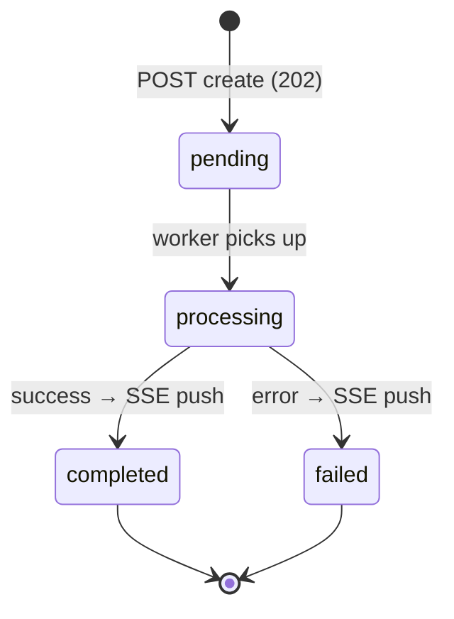
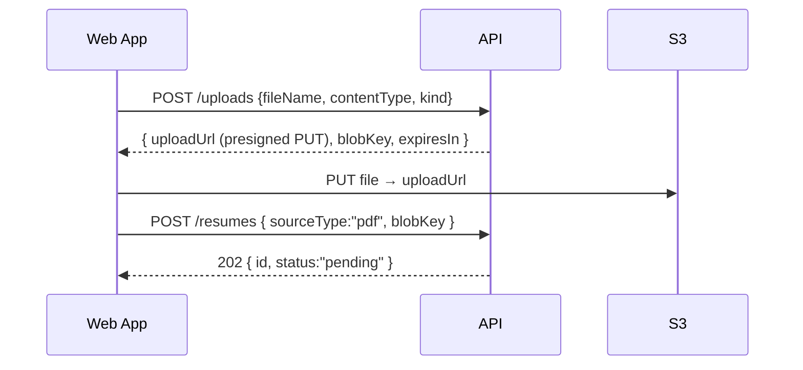

# API Design

> **Document 05 of 16** · Depends on: [03-domain-model](03-domain-model.md), [04-database-design](04-database-design.md) · Implements requirement 5

A versioned REST API over HTTPS/JSON, implemented with ASP.NET Core 10 minimal-API endpoint groups (one group per bounded context). Long-running work is asynchronous: clients create a resource, poll or subscribe, then read the result.

---

## 1. Conventions

- **Base path**: `/api/v1`. Version in the path; breaking changes increment the major.
- **Auth**: `Authorization: Bearer <JWT>` on every endpoint except health and auth callbacks. JWT validated against the IdP JWKS (Doc 10).
- **Media type**: `application/json; charset=utf-8`. File uploads use presigned S3 URLs (see §4), not multipart through the API.
- **IDs**: UUID v7 strings.
- **Timestamps**: ISO-8601 UTC.
- **Errors**: RFC 9457 `application/problem+json` with a stable `code`.
- **Idempotency**: unsafe POSTs accept an `Idempotency-Key` header; replays return the original result.
- **Pagination**: cursor-based — `?cursor=<opaque>&limit=20`; response carries `nextCursor`.
- **Correlation**: `X-Correlation-Id` echoed and propagated into traces/logs (Doc 11).
- **Rate limiting**: per-candidate token bucket (Doc 10); `429` with `Retry-After`.

### Async resource lifecycle

Creation endpoints return **`202 Accepted`** with a resource whose `status` is `pending`. Clients then either:
- subscribe to **Server-Sent Events** at `GET /api/v1/events` (auth via short-lived token), or
- poll the resource until `status` is `completed`/`failed`.



## 2. Resource map

| Resource | Methods | Purpose |
|---|---|---|
| `/auth/session` | GET | Current candidate profile/plan |
| `/uploads` | POST | Get a presigned S3 URL for a file upload |
| `/companies/analyses` | POST, GET (list) | Create/list company analyses |
| `/companies/analyses/{id}` | GET, DELETE | Read/delete one analysis |
| `/resumes` | POST, GET (list) | Create/list resumes |
| `/resumes/{id}` | GET, DELETE | Read/delete a resume |
| `/resumes/{id}/current` | PUT | Mark as current |
| `/job-descriptions` | POST, GET (list) | Create/list JD analyses |
| `/job-descriptions/{id}` | GET, DELETE | Read/delete a JD analysis |
| `/preparations` | POST, GET (list) | Create/list preparations |
| `/preparations/{id}` | GET, DELETE | Read a fused prep |
| `/preparations/{id}/export` | POST | Export prep to PDF/Markdown |
| `/mock-sessions` | POST, GET (list) | Start/list mock interviews |
| `/mock-sessions/{id}` | GET | Read session + transcript |
| `/mock-sessions/{id}/messages` | POST | Submit an answer, get score + next Q |
| `/mock-sessions/{id}/complete` | POST | End session, get final score |
| `/usage` | GET | Token/cost usage for the candidate |
| `/events` | GET (SSE) | Realtime completion notifications |
| `/health/live`, `/health/ready` | GET | Liveness/readiness probes |

## 3. Representative contracts

### 3.1 Create a company analysis

```http
POST /api/v1/companies/analyses
Authorization: Bearer <jwt>
Idempotency-Key: 0b5f...e1
Content-Type: application/json

{
  "sourceType": "url",
  "url": "https://www.acme.com/about",
  "options": { "includeLikelyQuestions": true }
}
```

```http
202 Accepted
Location: /api/v1/companies/analyses/018f9a...
Content-Type: application/json

{
  "id": "018f9a...",
  "status": "pending",
  "sourceType": "url",
  "createdAt": "2026-06-07T02:31:00Z"
}
```

When complete, `GET /api/v1/companies/analyses/{id}`:

```json
{
  "id": "018f9a...",
  "status": "completed",
  "companyName": "Acme Corp",
  "industry": "Industrial automation",
  "profile": { "overview": "Acme builds…", "website": "https://acme.com" },
  "sections": [
    { "type": "overview", "content": "…", "highlights": ["Founded 1998", "…"] },
    { "type": "culture", "content": "…", "highlights": ["Ownership", "…"] },
    { "type": "hiringProcess", "content": "…", "highlights": ["4 rounds"] },
    { "type": "interviewStyle", "content": "…", "highlights": [] }
  ],
  "likelyQuestions": [
    { "id": "q1", "text": "Why Acme?", "category": "behavioral", "difficulty": "easy",
      "rationale": "Values-fit screen common at Acme" }
  ],
  "completedAt": "2026-06-07T02:31:42Z"
}
```

### 3.2 Generate a preparation (fusion)

```http
POST /api/v1/preparations
Content-Type: application/json

{
  "companyAnalysisId": "018f9a...",
  "resumeId": "018fb1...",
  "jobDescriptionId": "018fc2...",
  "focus": ["technical", "behavioral"],
  "targetSeniority": "senior"
}
```

`422 Unprocessable Entity` if any input is not `completed` or not owned by the caller:

```json
{
  "type": "https://docs.interviewcopilot.ai/errors/inputs-not-ready",
  "title": "Inputs not ready",
  "status": 422,
  "code": "preparation.inputs_not_ready",
  "detail": "Resume 018fb1 is still processing.",
  "errors": { "resumeId": ["must be in 'completed' status"] }
}
```

Completed `GET /api/v1/preparations/{id}` returns technical/behavioral questions (each with follow-ups + optional STAR), `gaps[]`, `tips[]`, and a `roadmap` with milestones and time estimates.

### 3.3 Mock interview turn

```http
POST /api/v1/mock-sessions/{id}/messages
Content-Type: application/json

{ "answer": "At my last role I led a migration that…" }
```

```json
{
  "turnIndex": 3,
  "score": { "relevance": 8, "depth": 7, "communication": 9, "structure": 6, "total": 30 },
  "feedback": "Strong impact framing. Quantify the result and name the trade-offs you rejected.",
  "nextQuestion": "How did you decide between a big-bang and an incremental migration?",
  "runningScore": 27.5
}
```

## 4. File uploads (presigned, two-phase)

The API never streams large files through itself. Instead:



`POST /uploads` validates content type and size against the candidate's plan, returns a short-lived presigned `PUT` URL scoped to a single key under `uploads/{ownerId}/...`.

## 5. Error model

All non-2xx responses are `problem+json`. Stable codes are namespaced by context:

| HTTP | code (examples) | When |
|---|---|---|
| 400 | `validation.failed` | FluentValidation failure (with `errors` map) |
| 401 | `auth.unauthenticated` | Missing/invalid token |
| 403 | `auth.forbidden` | Authenticated but not the resource owner |
| 404 | `resource.not_found` | Unknown/inaccessible id |
| 409 | `resume.already_current` | Idempotency / state conflict |
| 422 | `preparation.inputs_not_ready` | Semantic precondition unmet |
| 429 | `rate_limit.exceeded` | Throttled (`Retry-After`) |
| 500 | `internal.error` | Unhandled fault (correlationId returned, details hidden) |
| 502 | `ai.provider_unavailable` | All providers failed (after fallback) |

A single global exception handler maps domain `Error` codes and exceptions to this shape; handlers return `Result<T>` and never write HTTP directly.

## 6. OpenAPI, SDK & realtime

- **OpenAPI 3.1** generated by the built-in ASP.NET Core OpenAPI support; served at `/openapi/v1.json`, with a Scalar/Swagger UI in non-prod.
- A **typed TypeScript client** is generated from the spec in CI (`openapi-typescript`) and consumed by the frontend (Doc 06) — the contract is the single source of truth.
- **Realtime**: SSE (`GET /events`) is the default for one-way completion pushes; the Mock Interview optionally upgrades to **SignalR/WebSocket** for low-latency duplex when streaming the interviewer's response token-by-token.

## 7. Versioning & deprecation

- URL-path major versioning (`/v1`, `/v2`). Minor/non-breaking changes are additive within a major.
- Deprecations announced via `Deprecation` + `Sunset` response headers and changelog, with a minimum 90-day window for paying customers.
