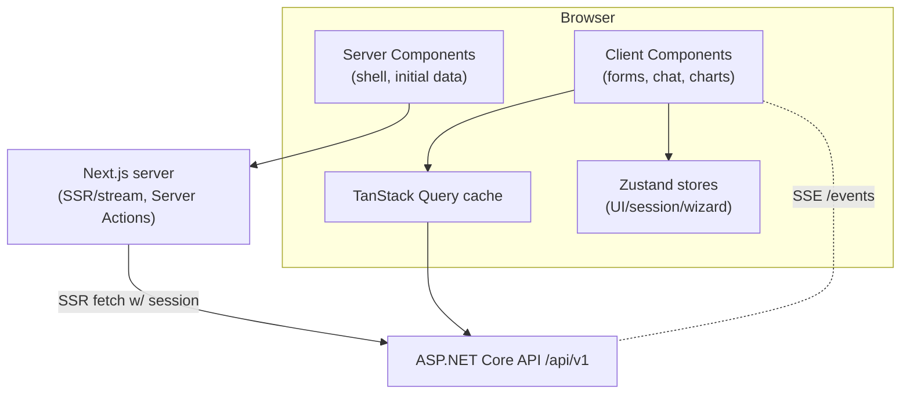

# Frontend Architecture

> **Document 06 of 16** · Depends on: [05-api-design](05-api-design.md), [../DESIGN.md](../DESIGN.md) · Implements requirement 6

The web app is **Next.js 16.2** (App Router) on **React 19.2**, TypeScript end-to-end, styled with **Tailwind 4** + **shadcn/ui**, animated with **Framer Motion**, with **TanStack Query v5** for server state and **Zustand** for ephemeral client state. The design language is specified in [DESIGN.md](../DESIGN.md).

---

## 1. Rendering strategy

Next.js 16 makes **Server Components the default** and **Turbopack** the default bundler. We exploit that:

- **Server Components** render the shell, fetch initial data with the user's session, and stream HTML — fast first paint, less client JS.
- **Client Components** (`"use client"`) are used only where interactivity lives: forms, the mock-interview chat, charts, drag/drop upload, anything with state or effects.
- **Cache Components / `use cache`** memoize expensive, non-personalized server work (e.g., marketing pages, static help content).
- **Route handlers / Server Actions** proxy a few mutations to attach the httpOnly session token, but the bulk of data flows browser → API directly with a Bearer token (Doc 05).



## 2. Folder structure

```
frontend/
├── app/
│   ├── (marketing)/                # public landing, pricing — static/cached
│   │   └── page.tsx
│   ├── (auth)/                     # sign-in/up, callback
│   ├── (app)/                      # authenticated shell (layout w/ sidebar)
│   │   ├── layout.tsx
│   │   ├── dashboard/page.tsx
│   │   ├── companies/
│   │   │   ├── page.tsx            # list
│   │   │   ├── new/page.tsx        # create wizard
│   │   │   └── [id]/page.tsx       # report
│   │   ├── resumes/
│   │   ├── job-descriptions/
│   │   ├── preparations/
│   │   │   └── [id]/page.tsx       # the big fused view
│   │   └── mock/[id]/page.tsx      # chat interview
│   ├── layout.tsx                  # root: fonts, theme, providers
│   ├── globals.css                 # Tailwind 4 + design tokens
│   └── error.tsx / not-found.tsx
├── components/
│   ├── ui/                         # shadcn primitives (button, card, dialog…)
│   ├── companies/ resumes/ prep/ mock/   # feature components
│   └── shared/                     # layout, nav, status, empty/loading states
├── lib/
│   ├── api/                        # generated client + fetch wrapper
│   ├── query/                      # TanStack Query client + keys
│   ├── auth/                       # session helpers
│   └── utils.ts
├── stores/                         # Zustand slices
├── hooks/                          # useAnalysis, useMockSession, useSSE…
├── types/                          # generated from OpenAPI
└── (config) next.config.ts, tailwind, tsconfig, components.json, .env.example
```

## 3. State management — the split

A strict separation prevents the classic "everything in one global store" mess:

| Kind of state | Owner | Examples |
|---|---|---|
| **Server/remote state** | TanStack Query | analyses, resumes, preparations, usage — anything from the API |
| **Ephemeral UI state** | Zustand | wizard step, sidebar open, theme, active mock draft, optimistic toasts |
| **URL state** | Router/searchParams | filters, pagination cursor, selected tab |
| **Form state** | React Hook Form + Zod | every form, validated against the same shapes as the API |

**Rule:** never cache server data in Zustand. TanStack Query owns fetching, caching, deduping, retries, background refetch, and invalidation.

### TanStack Query patterns

- **Query keys** are centralized and typed (`queryKeys.companies.detail(id)`), so invalidation is precise.
- **Polling vs SSE**: async resources subscribe to `/events` via a single `useSSE` hook; on a `*.completed` event we `queryClient.invalidateQueries` for that key — no manual polling loops.
- **Optimistic updates** for mock-interview answers and "mark current resume," rolled back on error.
- **Suspense + streaming**: list pages use `HydrationBoundary` from a server prefetch so the user sees data on first paint.

### Zustand stores (slices)

```
stores/
├── ui.store.ts        # theme, sidebar, command palette
├── wizard.store.ts    # multi-step create flows (company/prep)
└── mock.store.ts      # in-progress answer draft, timer, local transcript
```

## 4. Data fetching wrapper

A thin typed `apiFetch` wraps the generated client:

- injects the Bearer token and `X-Correlation-Id`,
- normalizes `problem+json` into a typed `ApiError` (with `code`),
- handles `401` (refresh/redirect) and `429` (respect `Retry-After`) centrally,
- is the only place that knows the API base URL.

The OpenAPI-generated `types/` guarantees the client and server never drift (Doc 05 §6).

## 5. Key experiences

**Create wizards (Company / Prep).** A `wizard.store` drives a multi-step flow: choose source → upload/enter → confirm → submit → live progress. Progress uses the SSE hook to flip from skeleton to result without a reload.

**Preparation view.** The flagship screen: tabbed technical/behavioral questions (each expandable to follow-ups + STAR scaffold), a gap-analysis panel with severity chips, prep tips, and a roadmap timeline. Export-to-PDF triggers the API export endpoint.

**Mock interview.** A focused chat UI (client component). User answers stream to the API; the interviewer's reply and per-turn score animate in with Framer Motion. `mock.store` holds the in-progress draft and a soft timer; the transcript of record is the server. Optional token-streaming via SignalR.

## 6. Performance & quality

- **React Compiler** (stable in Next 16) auto-memoizes — we avoid manual `useMemo`/`useCallback` noise.
- **Code-splitting** by route; heavy client widgets (charts, editor) `dynamic()`-imported.
- **Images** via `next/image`; **fonts** via `next/font` (no layout shift).
- **Bundle budget** enforced in CI; Lighthouse + Web Vitals (LCP/INP/CLS) tracked.
- **Accessibility**: shadcn/Radix primitives are accessible by default; we add focus management for dialogs/chat, prefers-reduced-motion gates on Framer animations, and run `axe` in CI (Doc 11, DESIGN.md §a11y).

## 7. Testing

| Level | Tool | Scope |
|---|---|---|
| Unit | Vitest + Testing Library | components, hooks, stores |
| Contract | MSW | mock the API from the OpenAPI spec |
| E2E | Playwright | sign-in → create analysis → prep → mock |
| Visual | Playwright snapshots / Chromatic (optional) | key screens, dark mode |

## 8. Environments & config

- `NEXT_PUBLIC_API_BASE_URL`, `NEXT_PUBLIC_AUTH_DOMAIN`, etc. in `.env.example`; secrets stay server-side.
- Built as a standalone output, containerized, and served behind CloudFront (Doc 08).
