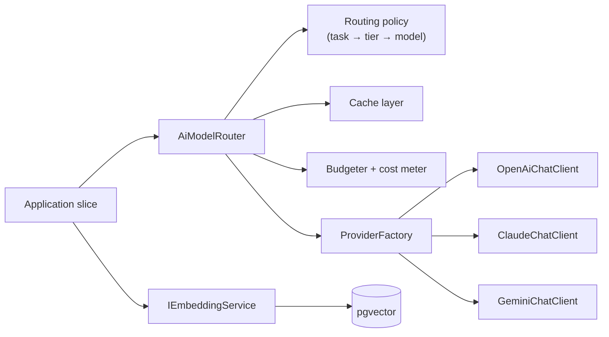
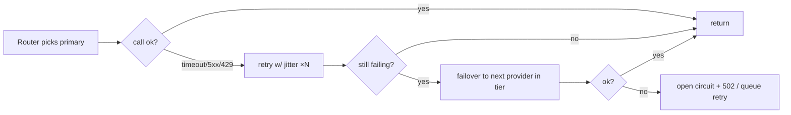
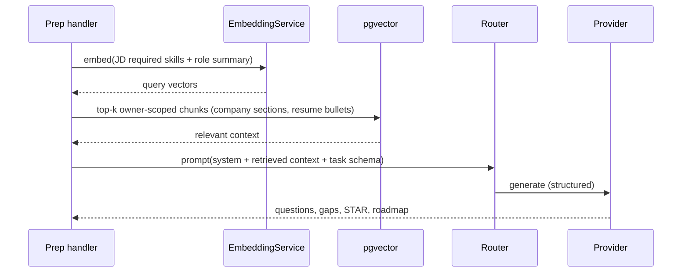

# AI Architecture

> **Document 07 of 16** · Depends on: [01-system-architecture](01-system-architecture.md), [04-database-design](04-database-design.md) · Cost detail in [14-cost-estimation](14-cost-estimation.md)

AI is the product's engine and its biggest variable cost. This document defines the **provider-agnostic abstraction**, the **model-routing policy** that picks the cheapest model meeting each task's quality bar, the **RAG** design, **structured output** discipline, **cost optimization**, and **safety/evaluation**.

---

## 1. Provider abstraction (ports)

No business code references a vendor SDK. The Application layer defines ports; Infrastructure provides adapters for OpenAI, Anthropic Claude, and Google Gemini.

```csharp
public interface IChatCompletionService
{
    Task<ChatResult> CompleteAsync(ChatRequest request, CancellationToken ct);
    IAsyncEnumerable<ChatChunk> StreamAsync(ChatRequest request, CancellationToken ct);
}

public interface IEmbeddingService
{
    Task<IReadOnlyList<float[]>> EmbedAsync(IReadOnlyList<string> inputs, CancellationToken ct);
}

// Vendor-neutral request: the router fills Model from policy, not the caller.
public sealed record ChatRequest(
    AiTask Task,                       // CompanyOverview, ResumeParse, PrepGeneration, MockScore…
    IReadOnlyList<ChatMessage> Messages,
    JsonSchema? ResponseSchema = null, // for structured output
    QualityTier MinQuality = QualityTier.Standard,
    int? MaxOutputTokens = null,
    bool AllowCache = true);
```



## 2. Model routing & tiering (the core cost lever)

Each `AiTask` is mapped to a **quality tier**, and each tier to a **prioritized model list** per provider. The router selects the first available model that meets the tier, applying caching and budget checks. Tiers decouple "what quality this task needs" from "which model/version is cheapest today" — when prices or models change, we edit policy config, not code.

| Tier | Use for | Candidate models (June 2026) |
|---|---|---|
| **Economy** | Resume parsing, keyword/skill extraction, classification, chunk summarization | Gemini 3.1 Flash-Lite, GPT-5.4 Nano, Claude Haiku 4.5 |
| **Standard** | Company section synthesis, JD analysis, gap recommendations, mock scoring | Gemini 3.1 Flash/Pro, GPT-5.4, Claude Sonnet 4.6 |
| **Premium** | Full preparation generation, nuanced behavioral coaching, system-design mock | Claude Opus 4.8, GPT-5.5, Gemini 3.1 Pro |

> Pricing for these models is tabulated in [14-cost-estimation](14-cost-estimation.md). The router reads a `ModelCatalog` (provider, model, tier, input/output \$/MTok, context window, supports-caching) from config so pricing updates are a config change.

**Routing policy (pseudo):**

```
choose(task):
  tier   = policy.tierFor(task)                 # e.g. ResumeParse → Economy
  models = catalog.byTier(tier).orderBy(costPerExpectedCall, providerHealth)
  for m in models:
     if circuitBreaker(m.provider).closed and budget.allows(m):
         return m
  raise AllProvidersUnavailable     # → 502 ai.provider_unavailable
```

Selection also respects: per-candidate/plan budget, provider health (circuit breaker), required capabilities (e.g., vision for image sources, JSON-schema support), and a configurable **default provider** for ties.

## 3. Resilience & fallback



- **Timeouts, retries with exponential backoff + jitter**, and **per-provider circuit breakers** (Polly).
- **Cross-provider failover** within the same tier keeps a single provider outage from taking the feature down — a direct benefit of the abstraction.
- Background (worker) tasks additionally get **SQS redelivery + DLQ** for poison messages.

## 4. Retrieval-Augmented Generation (RAG)

Preparation and mock interviews ground their output in the candidate's own data instead of stuffing whole documents into the prompt — improving relevance **and** cutting tokens.



- **Chunking**: resume bullets and company sections are chunked and embedded on completion (Doc 04 `content_embeddings`).
- **Retrieval**: HNSW cosine search, always filtered by `owner_id` (tenant isolation + smaller search space).
- **Context budget**: top-k tuned per task; retrieved context replaces full-document stuffing, the single biggest token saver for Preparation.

## 5. Structured output

Every AI call that feeds the domain requests **schema-constrained JSON** (provider-native JSON schema / tool-calling), validated against the same C# DTO before it touches an aggregate. Free-form text is only used for human-facing prose fields.

- Define the JSON schema once from the response DTO; pass it as `ResponseSchema`.
- Validate the response; on schema violation, one **repair attempt** (re-prompt with the validation error), then fail the job → `failed` status (no garbage in the DB).
- This makes AI output as trustworthy as any other validated input and keeps the domain clean.

## 6. Prompt management

- **Versioned, file-based prompt templates** (`Infrastructure/Ai/Prompts/*.md`) with placeholders; never inline string-concatenation in handlers.
- **System prompts** encode role, output schema, grounding rules ("use only provided context; if unknown, say so"), and anti-fabrication constraints.
- **Prompt registry** maps `(AiTask, version)` → template; A/B and rollbacks are config-driven.
- **PII minimization**: prompts include only the chunks needed; raw files are never sent wholesale.

## 7. Cost optimization (requirement 14)

The levers, in priority order:

1. **Right-size with tiers.** Economy models for extraction/classification (the high-volume tasks); Premium only for the few high-value generations. (Largest saver.)
2. **Prompt caching.** All three providers support caching repeated input (system prompts, retrieved context) at 75–90% off cached tokens — we structure prompts so the stable prefix is cacheable.
3. **RAG over stuffing.** Retrieve top-k chunks instead of whole documents (§4).
4. **Batch API** for non-interactive jobs (e.g., re-embedding, bulk company analysis) at ~50% off.
5. **Output token caps** per task; ask for concise structured fields.
6. **Response cache** (Redis) keyed by normalized input hash for idempotent analyses — re-running the same URL/resume is free.
7. **Token accounting** on every call → `token_usage` table → per-candidate/plan budgets and dashboards (Doc 11, 14). Budgets can **downgrade tier** or **defer to batch** when a candidate nears a cap.

```mermaid
flowchart TB
    req[AI request] --> c1{response cached?}
    c1 -- yes --> done[return cached]
    c1 -- no --> c2{stable prefix cacheable?}
    c2 -- yes --> pc[use provider prompt cache]
    c2 --> tier[pick cheapest qualifying model]
    tier --> call[call provider]
    call --> meter[record TokenUsage + cost]
    meter --> done
```

## 8. Safety, evaluation & guardrails

- **Grounding & anti-hallucination**: system prompts forbid inventing company facts; ungrounded fields are returned empty rather than fabricated. Company facts cite the source section.
- **Input safety**: uploaded content is treated as untrusted; prompt-injection mitigations (delimited context, instruction hierarchy, ignore-embedded-instructions rules).
- **Output moderation**: a lightweight check on generated questions/feedback for harmful content before persistence.
- **Evaluation harness**: a `golden set` of inputs with expected-shape assertions and rubric-based LLM-as-judge scoring runs in CI on prompt changes; regressions block merge. Per-task quality metrics (schema-valid rate, groundedness, latency, cost) tracked in dashboards.
- **Human feedback loop**: thumbs up/down on generated artifacts feeds prompt iteration.

## 9. Why three providers

Beyond resilience: providers differ by **price/quality at each tier**, **modality** (vision for image ingestion), **context window**, and **rate limits**. The router lets us route each task to the best-value option and shift traffic instantly when a provider changes pricing, deprecates a model, or degrades — turning multi-provider from a liability into a cost-and-reliability advantage.
