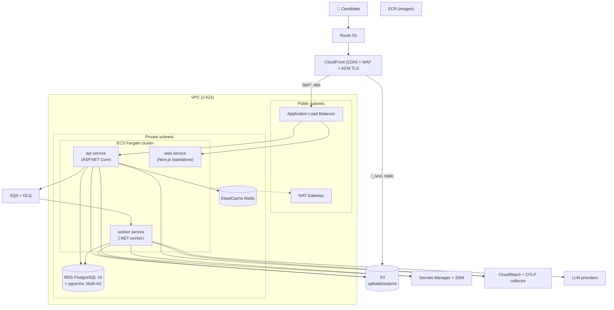

# Deployment Architecture

> **Document 08 of 16** · Depends on: [02-c4-diagrams](02-c4-diagrams.md) · Implements requirement 7

The platform deploys to **AWS**, containerized with **Docker**, provisioned as **Infrastructure as Code with Terraform**. Compute is **ECS Fargate** (serverless containers) to avoid managing servers while keeping full control of the runtime.

---

## 1. Topology



## 2. Component choices & rationale

| Concern | Service | Why |
|---|---|---|
| Edge/CDN/TLS | CloudFront + ACM | Cache static assets, terminate TLS, global latency, shields origin |
| Edge security | AWS WAF | OWASP managed rules, rate-based rules, bot control |
| Ingress | ALB | Path routing (`/api/*` → api, rest → web), health checks, TLS to origin |
| Compute | ECS Fargate | Containers without server management; per-service autoscaling |
| Database | RDS PostgreSQL 16, Multi-AZ | Managed Postgres + pgvector; automated failover, PITR |
| Cache/locks | ElastiCache Redis | Response cache, rate limiting, distributed locks |
| Queue | SQS (+ DLQ) | Durable async job buffer; decouples API from worker |
| Object store | S3 (SSE-KMS) | Uploads, exports; presigned access |
| Secrets | Secrets Manager + SSM | Rotated secrets, typed config; injected as env at task start |
| Registry | ECR | Image storage with scan-on-push |
| Observability | CloudWatch + OTel Collector | Logs/metrics/traces (Doc 11) |

> **Alternative considered:** EKS (Kubernetes). Rejected for the MVP/early stage — Fargate delivers the needed scale with far lower operational overhead. The container images are orchestrator-agnostic, so an EKS migration later is low-friction if scale demands it (captured as an ADR).

## 3. Networking & isolation

- **VPC across two Availability Zones**; private subnets host all compute and data. Only the ALB and NAT live in public subnets.
- **No public IPs** on Fargate tasks; egress to LLM providers via **NAT Gateway** (or VPC endpoints where available).
- **Security groups** least-privilege: ALB→web/api only; api/worker→RDS/Redis only; nothing else ingress.
- **VPC endpoints** for S3, ECR, Secrets Manager, CloudWatch to keep AWS traffic off the internet and reduce NAT cost.

## 4. Scaling

| Service | Trigger | Range (prod) |
|---|---|---|
| api | CPU + ALB request count/target | 2–10 tasks |
| web | CPU + request count | 2–6 tasks |
| worker | **SQS `ApproximateNumberOfMessages`** (queue depth) | 1–20 tasks |
| RDS | vertical + read replicas for query load | 1 writer + 0–2 replicas |
| Redis | cluster mode shards | as needed |

Worker scaling on queue depth is the key elasticity lever: AI generation bursts (e.g., morning prep surge) scale workers independently of the synchronous API.

## 5. Environments

Three isolated environments, identical IaC, parameterized by Terraform workspaces/variables:

| Env | Purpose | Differences |
|---|---|---|
| **dev** | Integration, PR previews | Single-AZ, smaller instances, relaxed scaling, synthetic AI keys/budget caps |
| **staging** | Pre-prod, E2E, load tests | Prod-like, smaller scale, prod data shape (synthetic) |
| **prod** | Live | Multi-AZ, autoscaling, full observability, strict budgets |

Promotion is image-based: the exact image validated in staging is promoted to prod (Doc 09). Local development uses `docker-compose` (Postgres+pgvector, Redis, LocalStack for S3/SQS) — see `infra/docker-compose.yml`.

## 6. Infrastructure as Code (Terraform)

```
infra/terraform/
├── main.tf            # providers, backend (S3 state + DynamoDB lock)
├── variables.tf       # env, sizes, domain, image tags
├── network.tf         # VPC, subnets, NAT, routes, endpoints
├── ecs.tf             # cluster, services, task defs, autoscaling
├── rds.tf             # Postgres + pgvector param group, subnet group
├── elasticache.tf     # Redis
├── storage.tf         # S3 buckets + lifecycle + KMS
├── messaging.tf       # SQS + DLQ
├── edge.tf            # CloudFront, ACM, WAF, Route53
├── secrets.tf         # Secrets Manager, SSM params
├── iam.tf             # task roles (least privilege), GitHub OIDC role
├── observability.tf   # CloudWatch, alarms, OTel collector
└── outputs.tf
```

- **Remote state** in S3 with DynamoDB locking; one state per environment.
- **Modules** for reusable units (network, ecs-service, rds) keep environments DRY.
- **No click-ops** — every resource is in code; drift detection runs in CI (`terraform plan` on schedule).
- **IAM** task roles are scoped to exactly the buckets/queues/secrets each service uses.

## 7. Disaster recovery

- **RDS Multi-AZ** automatic failover; **PITR** (7-day prod). Monthly logical dumps to S3 → Glacier.
- **S3 versioning** + cross-region replication for critical buckets (optional, cost-gated).
- **Targets**: RPO ≤ 5 min (RDS), RTO ≤ 1 hour (re-apply IaC + restore snapshot). DR runbook in `docs/adr`/runbooks.
- **Stateless services** redeploy from images in minutes; all state is in managed services with their own DR.
