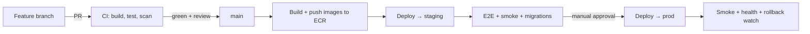
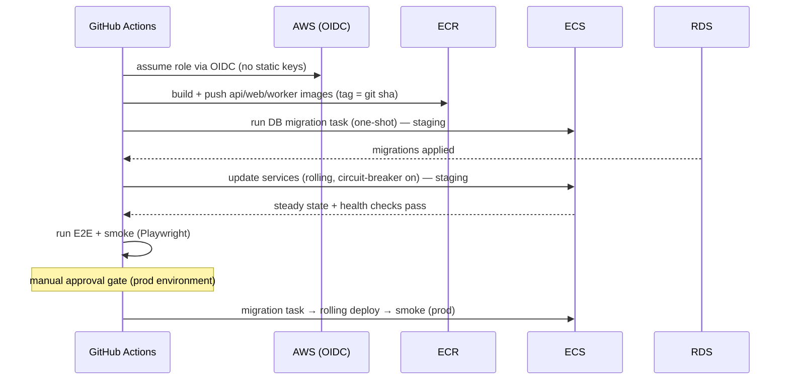

# CI/CD Architecture

> **Document 09 of 16** · Depends on: [08-deployment-architecture](08-deployment-architecture.md) · Implements requirement 8

CI/CD runs on **GitHub Actions** with **OIDC federation to AWS** (no long-lived cloud keys in GitHub). Trunk-based development, PR-gated CI, image-based promotion, and migrations-before-traffic deploys.

---

## 1. Branching & flow

- **Trunk-based**: short-lived feature branches → PR → `main`. `main` is always releasable.
- **PRs** require green CI, ≥1 review, and passing quality gates before merge (branch protection).
- **Releases** are continuous to staging on merge; **prod** deploys are gated by a manual approval (GitHub Environments protection rule).



## 2. Pipelines

```
.github/workflows/
├── ci-backend.yml     # .NET build, test, analyzers, arch tests, coverage
├── ci-frontend.yml    # Next.js typecheck, lint, unit, build, bundle budget
├── ci-infra.yml       # terraform fmt/validate/plan, tflint, checkov
├── ai-eval.yml        # prompt golden-set eval (on prompt/AI changes)
├── security.yml       # CodeQL, dependency review, secret scan, container scan
├── cd.yml             # build+push images, deploy staging→prod (OIDC)
└── release.yml        # tag, changelog, SBOM
```

### CI — backend (`ci-backend.yml`)
1. Restore (cached NuGet, central package mgmt).
2. Build with `TreatWarningsAsErrors`.
3. **Unit tests** (Domain + Application) + **architecture tests** (NetArchTest enforces the dependency rule & naming).
4. **Integration tests** against Postgres via **Testcontainers** (real pgvector).
5. Coverage gate (≥80% Domain+Application); `dotnet format --verify-no-changes`.

### CI — frontend (`ci-frontend.yml`)
1. Install (pnpm, cached).
2. **Typecheck** (tsc), **lint** (ESLint), **unit** (Vitest), **a11y** (axe).
3. **Build** (Turbopack) + bundle-size budget check.
4. Verify the **generated API client** is in sync with the committed OpenAPI spec (fails if drifted).

### CI — infra (`ci-infra.yml`)
`terraform fmt -check`, `validate`, **`plan`** (posted to the PR), `tflint`, and **`checkov`** policy scan. No `apply` from CI on PRs.

### Security (`security.yml`)
**CodeQL** (C# + TS), **dependency review** + Dependabot, **secret scanning** (gitleaks), **container image scan** (Trivy/ECR scan-on-push), license check. Findings above threshold fail the build (Doc 10).

### AI eval (`ai-eval.yml`)
On changes under `Infrastructure/Ai/Prompts/**` or routing policy: run the golden-set harness (schema-valid rate, groundedness, rubric scoring, cost/latency). Regressions block merge (Doc 07 §8).

## 3. CD (`cd.yml`)



**Key properties**
- **OIDC, no static credentials** — GitHub assumes a scoped IAM role (`iam.tf`).
- **Immutable images** tagged by commit SHA; the *same* image promoted staging→prod (no rebuild).
- **Migrations before traffic**: a one-shot ECS task applies EF Core migrations (expand/contract, Doc 04 §6) before the new task set serves requests.
- **Rolling deploy with ECS deployment circuit breaker** → auto-rollback if the new task set fails health checks.
- **Smoke tests** hit `/health/ready` and a canary user journey post-deploy.

## 4. Deployment safety

- **Health checks**: `/health/live` (process) and `/health/ready` (DB, Redis, queue, provider reachability) drive ALB + ECS.
- **Feature flags** decouple deploy from release; risky features (new provider, mock interview) ship dark and ramp.
- **Rollback**: re-point the ECS service to the previous task definition (previous image) — minutes. Migrations are backward-compatible by the expand/contract rule, so app rollback never requires a DB rollback.
- **Change traceability**: every deploy records git SHA, image digest, and migration version; surfaced in observability (Doc 11) for "what changed?" during incidents.

## 5. Supply chain & quality gates

| Gate | Tool | Blocks merge/deploy |
|---|---|---|
| Build warnings | Roslyn analyzers | ✔ |
| Architecture rules | NetArchTest | ✔ |
| Coverage | coverlet | ✔ (<80%) |
| SAST | CodeQL | ✔ (high severity) |
| Deps | Dependabot/dep-review | ✔ (vulnerable) |
| Secrets | gitleaks | ✔ |
| Containers | Trivy | ✔ (critical CVE) |
| IaC policy | checkov | ✔ (high) |
| SBOM | syft → release | recorded |
| AI quality | golden-set eval | ✔ (regression) |
