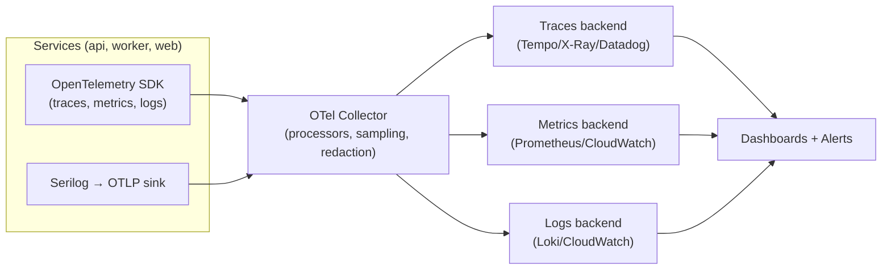
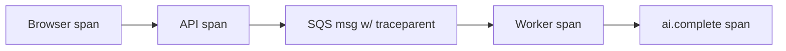

# Observability

> **Document 11 of 16** · Depends on: [01-system-architecture](01-system-architecture.md) · Implements requirement 14 (observability)

Observability is built in via **OpenTelemetry** (traces, metrics, logs) and **Serilog** (structured logging), exported over **OTLP** to a backend (CloudWatch + optional Grafana/Tempo/Prometheus or a vendor like Datadog/Honeycomb). Every request is traceable end-to-end, and AI cost is a first-class signal.

---

## 1. Three pillars + correlation

Every signal carries `trace_id`, `span_id`, `correlation_id`, `candidate_id` (hashed), `feature`, and deployment `version`/`git_sha`, so a log line, a trace, and a metric for the same request join up.

## 2. Tracing

- **Auto-instrumentation** for ASP.NET Core, HttpClient, Npgsql/EF Core, AWS SDK (SQS/S3), and Redis.
- **Custom spans** for the things that matter to *this* product:
  - `ingestion.extract` (source type, bytes, duration)
  - `ai.complete` (provider, model, tier, prompt/completion tokens, cost, cache hit, retry count)
  - `rag.retrieve` (k, similarity, ms)
  - `outbox.dispatch`, `worker.job`
- **Context propagation** browser → API → SQS → worker → provider via W3C `traceparent` (the `correlation_id` is also stamped on SQS message attributes so async work stays in the same trace).
- **Tail-based sampling** at the collector: keep 100% of errors and slow traces, sample the rest.

## 3. Logging (Serilog)

- **Structured JSON** logs, no string interpolation of data; enrichers add correlation/trace/version/feature.
- **Levels**: `Information` for request lifecycle, `Warning` for degraded (retry, fallback, near-budget), `Error` for faults. Debug off in prod.
- **PII redaction** at the collector and via Serilog destructuring policies — resume text, emails, and file contents are never logged (Doc 10 §5).
- Logs link to traces by `trace_id`.

## 4. Metrics (the ones we watch)

**Golden signals per service**: request rate, error rate, duration (p50/p95/p99), saturation (CPU/mem/queue depth).

**Product & AI metrics** (the differentiators):

| Metric | Why |
|---|---|
| `ai.tokens.total{provider,model,feature}` | Cost driver |
| `ai.cost.usd{provider,model,feature}` | Budget tracking (Doc 14) |
| `ai.cache.hit_ratio` | Effectiveness of caching lever |
| `ai.call.latency` / `ai.call.failures{provider}` | Provider health, circuit breaker |
| `ai.fallback.count{from,to}` | How often failover fires |
| `ai.schema.invalid_ratio{task}` | Output quality (Doc 07 §5) |
| `job.duration{type}` / `queue.depth` / `queue.dlq.count` | Async pipeline health |
| `analysis.completed` / `analysis.failed{type}` | Feature success rate |
| `mock.session.completed` / `prep.generated` | Activation/engagement |

## 5. Dashboards

- **Service health** — golden signals per service, deploy markers (git SHA).
- **AI cost & quality** — spend by provider/model/feature, cache hit ratio, schema-valid rate, fallback rate, cost per completed prep (unit economics, Doc 14).
- **Async pipeline** — queue depth, job durations, DLQ, worker autoscale.
- **Business funnel** — analyses started→completed, preps generated, mock sessions, conversion.

## 6. Alerting & SLOs

**SLOs (initial targets):**

| SLO | Target |
|---|---|
| API availability | 99.9% monthly |
| API p95 latency (sync endpoints) | < 400 ms |
| Analysis completion (async) p95 | < 60 s |
| Mock turn response p95 | < 6 s |
| AI schema-valid rate | > 99% |

**Alerts** are symptom-based and tied to SLOs/error budgets (not noisy host metrics):
- Error rate or p95 breaching SLO (burn-rate alerts).
- `queue.dlq.count > 0` / queue depth rising without worker scale-up.
- All providers unhealthy / fallback rate spike.
- **AI spend** anomaly or budget threshold (e.g., 80% of monthly cap).
- DB connections/CPU saturation; failover events.

Alerts route to on-call (PagerDuty/Opsgenie) with severity and a linked runbook; incident workflow per the `engineering:incident-response` skill.

## 7. Health checks

- `GET /health/live` — process up.
- `GET /health/ready` — dependencies reachable (DB, Redis, SQS, ≥1 AI provider). Drives ALB target health and ECS deploy gating (Doc 09). Degraded-but-serving (e.g., one provider down) reports ready; total provider outage reports not-ready for AI features.

## 8. Cost observability (closing the loop)

Every `ai.complete` span and the `token_usage` table feed a **cost-per-feature** and **cost-per-completed-outcome** view. This is what makes "AI cost optimization" measurable rather than aspirational: we can see, per release, whether a prompt change or model-routing change moved unit cost, and budgets can react automatically (Doc 07 §7, Doc 14).
