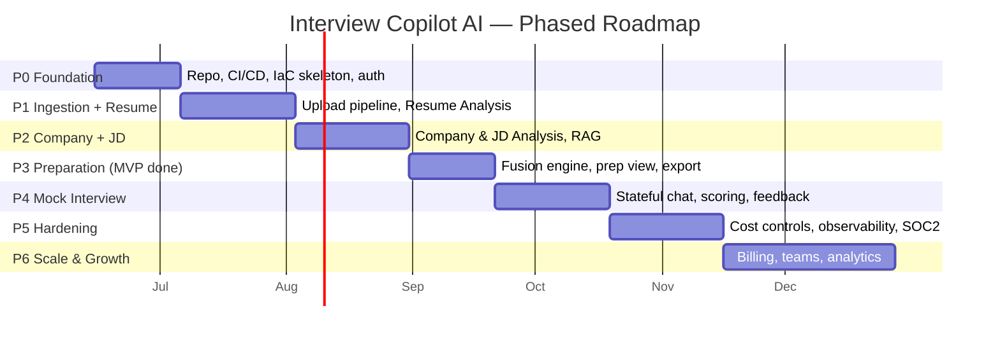

# Development Roadmap

> **Document 12 of 16** · Implements requirement 10 · Pairs with [15-mvp-plan](15-mvp-plan.md) and [16-sprint-plan](16-sprint-plan.md)

A phased plan that delivers value early and de-risks the hardest parts (AI quality, cost, async pipeline) first. Phases are outcome-oriented; sprint-level detail is in Doc 16.

---

## 1. Phases at a glance

## 2. Phase detail

### P0 — Foundation (≈3 weeks)
**Goal:** a deployable walking skeleton.
- Monorepo, `Directory.*.props`, `.editorconfig`, solution + 4 projects, Next.js app.
- CI (build/test/lint), security scans, Terraform for dev env, ECS deploy of a hello-world API + web.
- Auth (IdP integration), `candidates` table, health checks, OTel + Serilog baseline, ProblemDetails handler.
- **Exit:** authenticated user reaches an empty dashboard; pipeline green to dev; one trace visible end-to-end.

### P1 — Ingestion + Resume Analysis (≈4 weeks)
**Goal:** first real AI feature + the async backbone.
- Presigned upload, S3, ingestion extractors (PDF/DOCX/image/text), SQS, worker, outbox, SSE.
- AI provider abstraction + router + **one provider** live; structured output; resume parsing slice.
- Resume domain/aggregate, persistence, list/detail UI, live status.
- **Exit:** upload a resume → structured profile rendered; tokens metered; reliable async path proven.

### P2 — Company + JD Analysis + RAG (≈4 weeks)
**Goal:** the other two inputs and retrieval.
- URL ingestion + crawler-lite; Company Analysis sections + likely questions.
- JD Analysis (skills/keywords/tech/experience); deterministic `GapAnalyzer`.
- Embeddings + pgvector + retrieval; **second AI provider** + failover; prompt caching.
- **Exit:** all three inputs produce quality structured analyses; RAG retrieving owner-scoped context; provider failover demonstrated.

### P3 — Interview Preparation → **MVP complete** (≈3 weeks)
**Goal:** the headline outcome.
- `PreparationFactory` fusion; technical/behavioral questions, follow-ups, STAR, tips, roadmap.
- Flagship Preparation view; PDF/Markdown export.
- **Third provider**; tier-based routing tuned; AI eval golden-set in CI.
- **Exit:** end-to-end company+resume+JD → personalized prep; **this is the MVP** (Doc 15).

### P4 — AI Mock Interview (≈4 weeks)
**Goal:** interactive practice + scoring.
- `MockSession` aggregate, turn loop, rubric scoring, feedback, final score.
- Chat UI, optional token streaming (SignalR), modes (technical/behavioral/mixed/system-design).
- **Exit:** a candidate completes a scored mock grounded in their prep.

### P5 — Hardening & Cost (≈4 weeks)
**Goal:** production-grade.
- Full budgets/quotas, batch processing, response cache, cost dashboards & unit economics.
- Observability completeness, alerting/SLOs, load tests, DR drill.
- Security: WAF tuning, pen-test fixes, SOC 2 control implementation, data-subject rights flows.
- **Exit:** SLOs met under load; cost per prep within target; security gates green.

### P6 — Scale & Growth (≈6 weeks)
**Goal:** monetize and expand.
- Stripe billing, plans/quotas enforcement, usage UI.
- Team accounts, sharing, admin console.
- Product analytics, A/B prompt testing, more export formats, localization groundwork.
- **Exit:** paying customers; team plan; growth instrumentation.

## 3. Sequencing rationale

- **Async pipeline + AI abstraction are built in P1** because they're the riskiest and everything else depends on them — fail fast, learn early.
- **Resume before Company/JD** because resume parsing is the most self-contained AI task (good first proof) and feeds RAG quality.
- **Preparation is the MVP boundary (end of P3)** — it's the smallest end-to-end slice that delivers the core promise.
- **Mock Interview after MVP** because it's high-value but additive, not required to validate the core hypothesis.
- **Hardening before growth** so we don't scale problems.

## 4. Team shape (suggested)

| Role | Focus |
|---|---|
| 2× Backend (.NET) | Domain, slices, AI, pipeline |
| 1× Frontend (Next.js) | App, prep view, mock chat |
| 1× Platform/DevOps | IaC, CI/CD, observability, cost |
| 0.5× Design/Product | DESIGN.md, flows, prompts |
| 0.5× QA/Eval | E2E, AI eval harness |

A 4–5 person team delivers the MVP (end of P3) in roughly the timeline above; see Doc 16 for sprint allocation.
