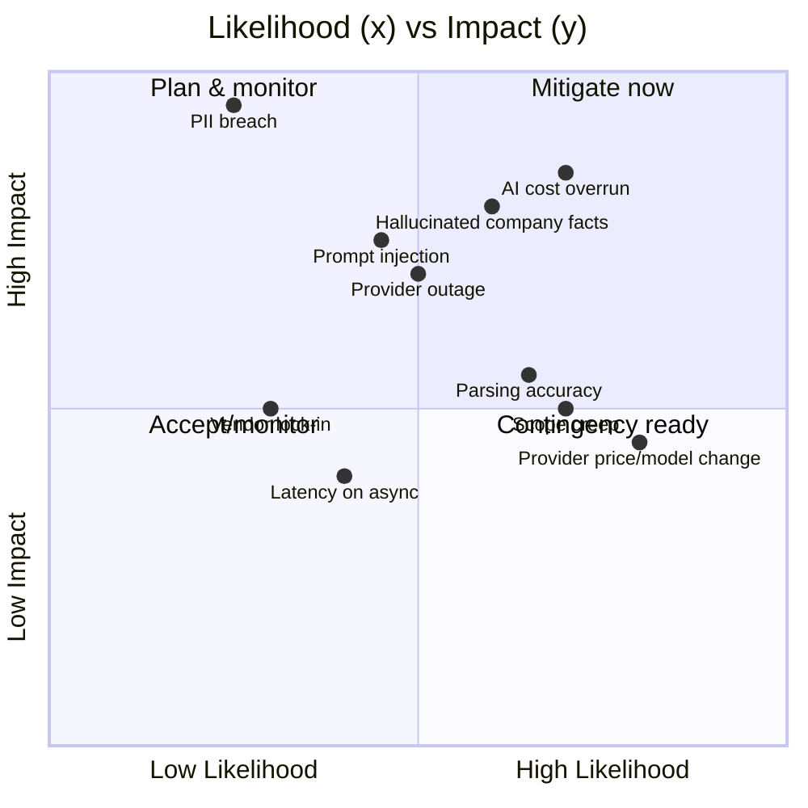

# Risk Analysis

> **Document 13 of 16** · Cross-cuts all docs · Deliverable: Risk Analysis

A living risk register. Each risk has a likelihood × impact rating, an owner area, mitigations already designed into the architecture, and a contingency. Scoring: L/M/H for likelihood and impact; **Severity** = combined priority.

---

## 1. Risk heat map

## 2. Register

### Product / AI risks

| # | Risk | L | I | Mitigations (designed in) | Contingency |
|---|---|---|---|---|---|
| R1 | **AI cost overrun** erodes margins | H | H | Tiered routing, prompt caching, RAG over stuffing, batch API, per-plan budgets, cost dashboards & unit economics (Docs 07, 11, 14) | Auto tier-downgrade/defer-to-batch at budget thresholds; raise plan prices/quota |
| R2 | **Hallucinated company facts** damage trust | M | H | Grounding rules, RAG, "say unknown" prompts, structured output + validation, source citation, output moderation, golden-set eval (Doc 07 §5/§8) | Flag low-confidence sections; human-review queue; disclaimer + feedback loop |
| R3 | **LLM provider outage** | M | H | Multi-provider abstraction, in-tier failover, circuit breakers, retries, SQS redelivery (Doc 07 §3) | Degrade gracefully (queue + notify); route all traffic to healthy provider |
| R4 | **Provider price/model deprecation** | H | M | Model catalog in config, tier indirection, three providers (Doc 07 §2) | Re-point tier to new model via config; no code change |
| R5 | **Resume/JD parsing inaccuracy** | M | M | Vision-capable models for images, structured schema, validation+repair, user-editable parsed output | Manual correction UI; reprocess; confidence surfacing |
| R6 | **Prompt injection via uploads** | M | H | Delimited untrusted context, instruction hierarchy, data-minimization, output moderation (Doc 10 §7) | Quarantine + reprocess with stricter template; block source |

### Engineering / delivery risks

| # | Risk | L | I | Mitigations | Contingency |
|---|---|---|---|---|---|
| R7 | **Scope creep** delays MVP | H | M | MVP boundary fixed at end of P3 (Doc 15), sprint plan, feature flags | Defer non-MVP to backlog; protect the P3 line |
| R8 | **Async pipeline complexity/bugs** | M | M | Outbox + idempotency + DLQ + tracing; built first in P1 (Doc 12) | DLQ replay tooling; runbook |
| R9 | **Architecture erosion** over time | M | M | Architecture tests (NetArchTest), code review, ADRs (Docs 01, 09) | Refactor sprint; re-assert tests |
| R10 | **Embedding model change** invalidates vectors | L | M | `model` column on embeddings, re-embed batch job (Doc 04 §4) | Background re-embed; dual-read during migration |

### Security / compliance risks

| # | Risk | L | I | Mitigations | Contingency |
|---|---|---|---|---|---|
| R11 | **PII breach** | L | H | Encryption everywhere, tenant isolation, least-privilege IAM, PII-free logs, short retention, WAF (Doc 10) | IR plan + breach notification; rotate keys; forensics |
| R12 | **Cross-tenant data leak (IDOR)** | L | H | Authorization behavior + EF global query filter (defense in depth) (Doc 10 §3) | Patch + audit; targeted access review |
| R13 | **Cost-DoS** (abusive AI usage) | M | M | Rate limits, budgets, WAF (Docs 07, 10) | Throttle/suspend offender; alert |
| R14 | **Compliance gap (GDPR/SOC2)** | M | M | Erasure/export flows, DPAs, SOC2 controls in P5 (Docs 04, 10, 12) | Engage auditor early; close control gaps |

### Business risks

| # | Risk | L | I | Mitigations | Contingency |
|---|---|---|---|---|---|
| R15 | **Weak differentiation** vs generic chatbots | M | H | Personalization via RAG on real resume+company+JD; explainability; mock scoring | Sharpen ICP; lean into grounded, cited output |
| R16 | **Vendor lock-in (AWS)** | L | M | Containerized, orchestrator-agnostic images; Terraform | Portable to EKS/other cloud with module swaps |
| R17 | **Low conversion / unit economics** | M | H | Cost-per-prep tracking, tiered plans, free→pro funnel (Docs 11, 14) | Adjust pricing/quotas; optimize tier routing |

## 3. Top-5 watchlist (review each sprint)

1. **R1 AI cost** — track cost-per-completed-prep vs target every release.
2. **R2 Hallucination** — golden-set groundedness score must not regress.
3. **R3 Provider outage** — failover drills; provider health dashboards.
4. **R7 Scope creep** — guard the MVP line; anything new goes to backlog.
5. **R11 PII** — security checklist on every release (Doc 10 §10).

## 4. Assumptions & dependencies

- LLM providers maintain enterprise/no-train API tiers and reasonable rate limits.
- AWS is the target cloud; managed services (RDS/SQS/S3) are acceptable.
- Resume/company/JD content is primarily English at launch (localization is P6+).
- A managed IdP (Cognito/Auth0) is used rather than building auth.
