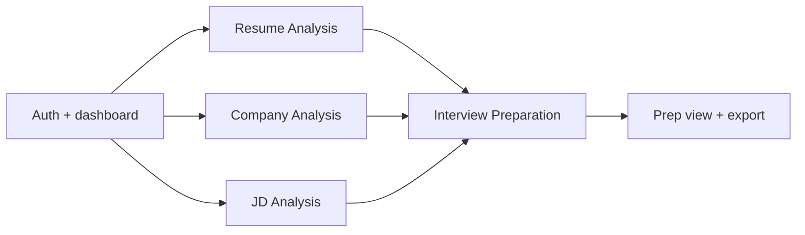
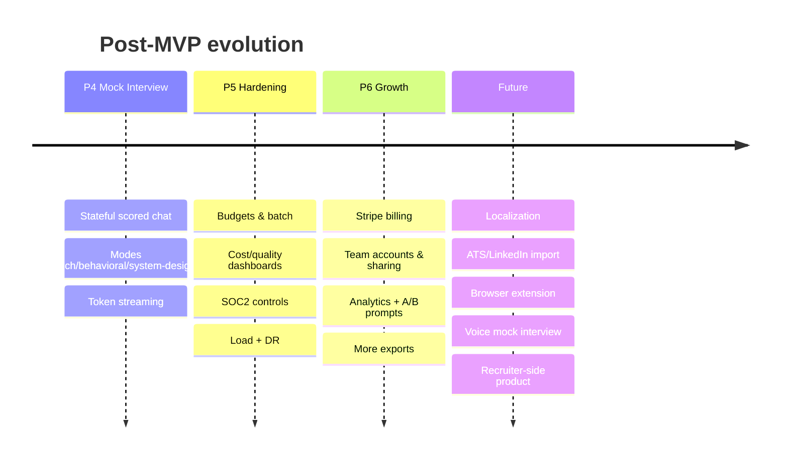

# MVP Plan & Future Roadmap

> **Document 15 of 16** · Implements requirement 11 · Pairs with [12-development-roadmap](12-development-roadmap.md), [16-sprint-plan](16-sprint-plan.md)

The MVP is the smallest build that proves the core hypothesis: *grounded, personalized interview prep from a candidate's resume + a target company + a JD is worth paying for.* That boundary lands at the **end of Phase 3** (Doc 12).

---

## 1. MVP hypothesis & success criteria

**Hypothesis:** Candidates will complete the upload→analyze→prepare flow and rate the output as more useful than generic advice.

**Success metrics (first 6–8 weeks post-MVP):**
- Activation: ≥ 40% of signups generate ≥ 1 Preparation.
- Quality: ≥ 70% thumbs-up on generated preps; AI schema-valid rate > 99%.
- Cost: cost-per-completed-prep within target (≤ ~$0.20 optimized, Doc 14).
- Reliability: async completion p95 < 60s; provider failover works in prod.

## 2. MVP scope (IN)

| Capability | MVP includes |
|---|---|
| **Accounts** | Sign up/in via IdP, single-user, free + one paid plan, basic quotas |
| **Resume Analysis** | PDF/DOCX/image upload, parse to structured profile, editable, stored |
| **Company Analysis** | URL + text + PDF input; overview, products/services, clients/industries, culture, locations, hiring process, interview style, likely questions |
| **JD Analysis** | Paste/upload; required skills, keywords, technologies, experience expectations |
| **Gap analysis** | Deterministic resume-vs-JD gaps with recommendations |
| **Interview Preparation** | Technical + behavioral questions, follow-ups, STAR suggestions, prep tips, learning roadmap |
| **Export** | Preparation → PDF/Markdown |
| **Platform** | Async pipeline, AI abstraction with **≥2 providers + failover**, tiered routing, prompt caching, token metering, observability, security baseline |

## 3. Explicitly OUT of MVP (deferred)

| Deferred | Phase | Why deferred |
|---|---|---|
| **AI Mock Interview** | P4 | High value but additive; not needed to validate the core promise |
| Premium "deep mode" (Opus/GPT-5.5 routing) | P4–P5 | Optimize after core quality proven |
| Stripe billing & metered usage | P6 | Manual/founder-led billing acceptable at MVP scale |
| Team accounts, sharing, admin console | P6 | Single-user first |
| Product analytics & A/B prompt testing | P5–P6 | Instrument once flows are stable |
| Localization / multi-language | P6+ | English-first |
| Third AI provider | P3 (late) / P4 | Two providers satisfy failover for MVP |
| Browser extension / ATS integrations | Future | Beyond core loop |

## 4. MVP cut-lines (if time-constrained)

If P1–P3 runs hot, cut in this order without breaking the core loop:
1. Image-source ingestion (keep PDF/DOCX/text).
2. Learning roadmap richness (ship a simpler milestone list).
3. PDF export (ship Markdown export only).
4. Editable parsed resume (ship read-only first).

Never cut: the fusion Preparation output, grounding/structured output, async reliability, or the security baseline.

## 5. Future roadmap (post-MVP)

### Future bets (beyond P6)

- **Voice mock interviews** (speech in/out) for realistic practice.
- **Calendar-aware prep** ("interview in 3 days → focused plan").
- **ATS / LinkedIn / job-board imports** to auto-populate JD & company.
- **Recruiter/coach side** (B2B): question banks, candidate readiness.
- **Continuous learning loop**: outcomes (offer/no-offer) feed model/prompt tuning.
- **Fine-tuned/distilled small models** for the highest-volume Economy tasks to cut cost further.

## 6. MVP → GA readiness checklist

- [ ] End-to-end journey works in prod for a real resume/company/JD
- [ ] ≥2 AI providers with demonstrated failover
- [ ] Tiered routing + prompt caching live; cost-per-prep tracked
- [ ] Async p95 < 60s; SSE live updates working
- [ ] Security checklist green (Doc 10 §10); PII retention jobs running
- [ ] Observability: traces, AI cost dashboard, alerts on SLOs
- [ ] Backups + one restore drill completed
- [ ] Quotas enforced; free-tier cost bounded
