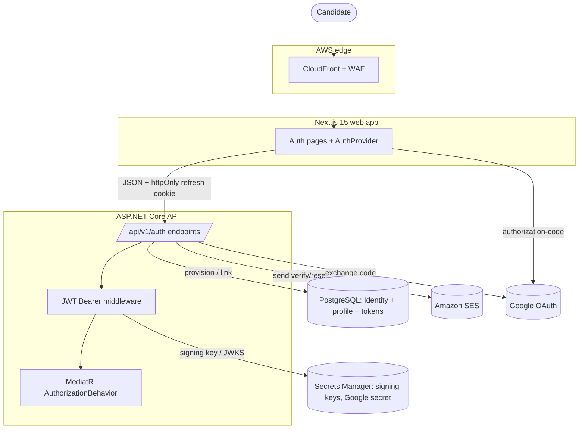
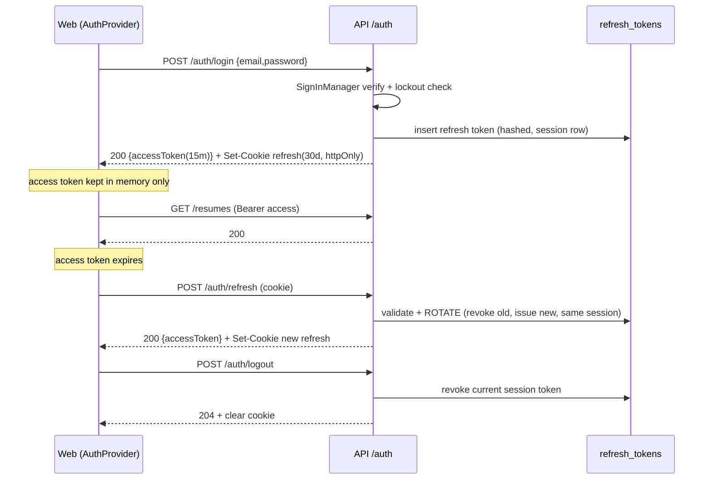
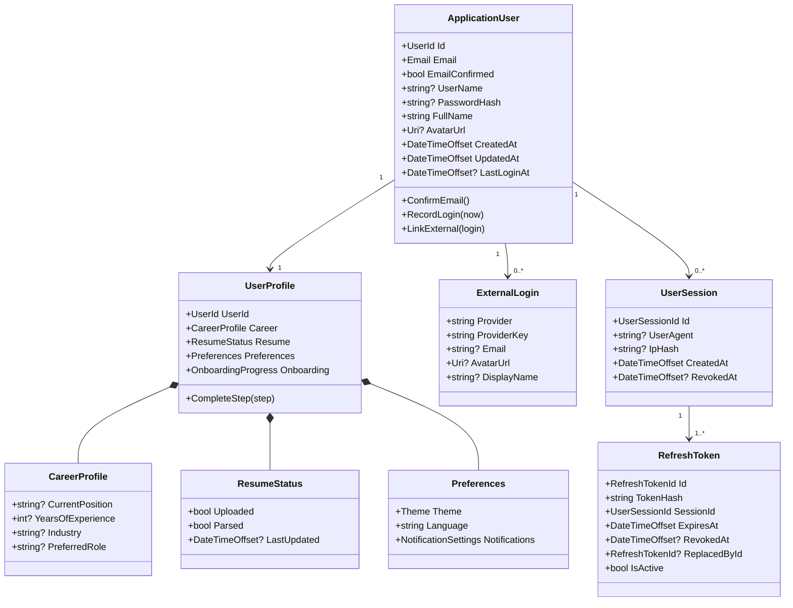
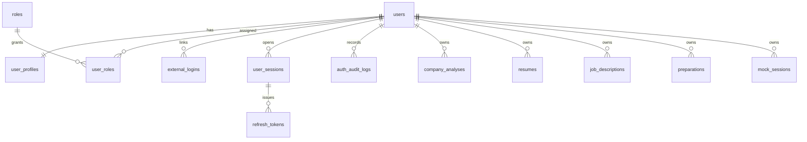
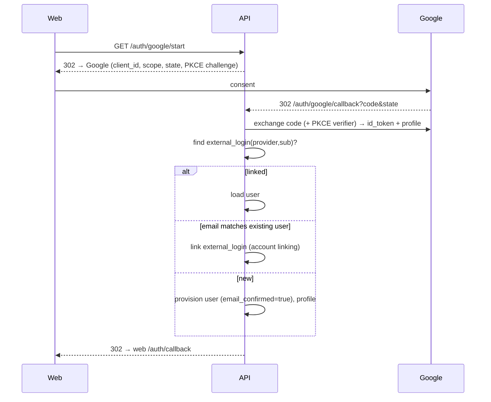
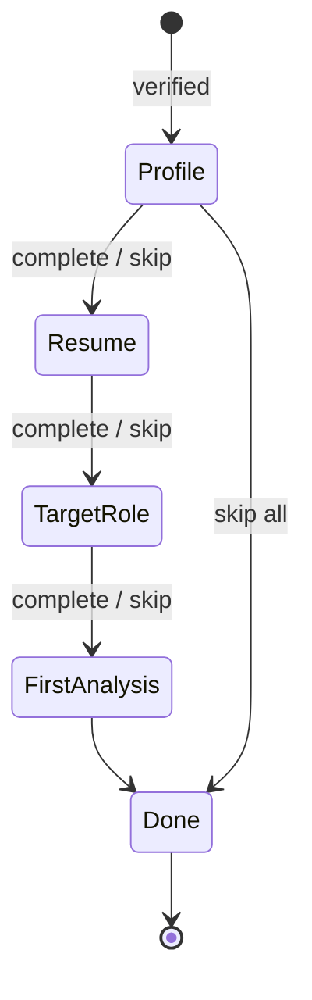

# Authentication & Authorization Architecture

> **Document 17 of 18** · Depends on: [03-domain-model](03-domain-model.md), [04-database-design](04-database-design.md), [05-api-design](05-api-design.md), [10-security-architecture](10-security-architecture.md) · Decision: [ADR 0005](../.claude/docs/adr/0005-self-hosted-aspnet-identity-auth.md) · Build plan: [18-auth-implementation-plan](18-auth-implementation-plan.md)

Interview Copilot now owns identity **first-party**: ASP.NET Identity on .NET 10 stores users and passwords, our API issues and rotates its own JWTs, and Google sign-in is integrated via the OAuth authorization-code flow. This supersedes the managed-IdP assumption in earlier `docs/10` (see ADR 0005). The dependency rule and tenant model are unchanged: `ApplicationUser.Id` is the value every owned row carries as `owner_id`, and `ICurrentUser.Id` still resolves from the validated JWT `sub`.

---

## 1. Goals & decisions

| Decision | Choice | Why |
|---|---|---|
| Identity store | ASP.NET Identity + EF Core + PostgreSQL | First-party flows, hardened password hashing & token providers, .NET-native |
| Identity root | `ApplicationUser` (UUID v7) — `candidates` folded in | Single identity; preserves `owner_id`/`ICurrentUser` contract |
| Access token | JWT, **15 min**, RS256, signed with a key in Secrets Manager | Short-lived; stateless validation; key rotation via JWKS |
| Refresh token | Opaque 256-bit, **30 days**, stored **hashed**, **rotated** on use | Revocable, theft-detectable, per-session |
| Social login | Google OAuth 2.0 authorization-code flow | Sign-in + sign-up + account linking by verified email |
| Authorization | Role-based **and** policy-based | `User` today; `Admin`/`Moderator`/`PremiumUser` ready |
| Web token transport | Refresh in **httpOnly, Secure, SameSite=Strict** cookie; access in memory | XSS-resistant refresh; CSRF-resistant via SameSite + double-submit |
| Email | Verification required before privileged actions | Anti-abuse, deliverability, account ownership |

Architecture placement (Clean + Vertical Slice, per `docs/01`):

- **Domain** — `ApplicationUser`, `UserProfile` (value objects: `CareerProfile`, `NotificationSettings`, `ResumeStatus`), `RefreshToken`, `ExternalLogin`, `UserSession`, role/permission constants, domain events. No EF/Identity types leak in.
- **Application** — `Auth` feature slices (commands/queries + validators + handlers), ports: `ITokenService`, `IRefreshTokenStore`, `IEmailSender`, `IGoogleOAuthClient`, `IPasswordResetService`, `IIdentityService`.
- **Infrastructure** — ASP.NET Identity stores, EF configurations, JWT signing, Google client, SES email sender, the `AuthorizationBehavior`.
- **Api** — `/api/v1/auth` minimal-API endpoint group, JWT bearer + cookie wiring, rate-limit policies, security-headers middleware.

## 2. Context (C4 L1/L2)



## 3. Token & session strategy

### 3.1 Lifecycle



### 3.2 Access token (JWT)

Claims: `sub` (user id), `email`, `email_verified`, `name`, `role[]`, `plan`, `sid` (session id), `jti`, `iat`, `exp` (+15 min), `iss`, `aud`. Signed **RS256**; the public key is published at `/.well-known/jwks.json` so validation is stateless and keys rotate without redeploy. No refresh capability and no PII beyond the above are embedded.

### 3.3 Refresh token (rotation + revocation)

- Generated as 256 bits of CSPRNG entropy; only a **SHA-256 hash** is stored (`refresh_tokens.token_hash`). The raw value lives solely in the httpOnly cookie.
- **Rotation:** every `/auth/refresh` revokes the presented token and issues a new one in the same `user_sessions` row. The old token's `replaced_by_id` is set.
- **Reuse detection:** if a *revoked* token is presented (replay/theft), the entire session chain is revoked and an `auth_audit_log` security event is written.
- **Revocation surfaces:** `logout` (current `sid`), `logout-all` (all sessions for the user), password change/reset (revoke all), and admin force-logout.
- Sliding behaviour is bounded: a refresh token's absolute expiry never exceeds 30 days from issue; idle sessions expire naturally.

### 3.4 Transport

| Client | Access token | Refresh token |
|---|---|---|
| Web (Next.js) | In-memory (React state/Zustand), `Authorization: Bearer` | `__Host-ic_refresh` cookie: httpOnly, Secure, SameSite=Strict, Path=/api/v1/auth |
| Native/API clients | `Authorization: Bearer` | Returned in body; client stores securely |

## 4. Domain model



Strongly-typed IDs follow `docs/03`: `readonly record struct UserId(Guid Value)` with `New() => Guid.CreateVersion7()`. `Email` is a value object (normalized, validated). `Theme` (`System|Light|Dark`) and `Language` are enums/codes. **Roles & permissions** live as constants (`Roles.Admin`, `Permissions.Companies_Read`) so policies reference symbols, not magic strings.

Domain events (past tense, per CLAUDE.md §3): `UserRegistered`, `EmailVerified`, `UserLoggedIn`, `ExternalLoginLinked`, `PasswordChanged`, `PasswordReset`, `AllSessionsRevoked`, `OnboardingStepCompleted`. `UserRegistered` triggers the verification email via the outbox (`docs/01` §5); `EmailVerified` provisions the empty `UserProfile`.

## 5. Database design

### 5.1 ERD (auth slice)



`users` is the former `candidates` table (renamed; `id` unchanged) plus ASP.NET Identity columns. All existing `owner_id` FKs continue to point at `users(id)`.

### 5.2 DDL

> Target SQL; produced by an EF Core migration (expand/contract, `docs/04` §6). `created_at`/`updated_at` (timestamptz) on every table. ASP.NET Identity supplies `users`, `roles`, `user_roles` with its standard columns; key custom additions shown.

```sql
-- ---------- Identity (ASP.NET Identity, renamed to project convention) ----------
CREATE TABLE users (                              -- AspNetUsers
    id                    uuid PRIMARY KEY,        -- UUID v7; == owner_id everywhere
    email                 citext UNIQUE NOT NULL,
    normalized_email      citext UNIQUE NOT NULL,
    email_confirmed       boolean NOT NULL DEFAULT false,
    user_name             citext UNIQUE,
    normalized_user_name  citext UNIQUE,
    password_hash         text,                    -- null for OAuth-only accounts
    security_stamp        text NOT NULL,           -- invalidates tokens on credential change
    concurrency_stamp     text NOT NULL,
    full_name             text NOT NULL DEFAULT '',
    avatar_url            text,
    plan                  text NOT NULL DEFAULT 'free',
    lockout_end           timestamptz,
    lockout_enabled       boolean NOT NULL DEFAULT true,
    access_failed_count   int NOT NULL DEFAULT 0,
    created_at            timestamptz NOT NULL DEFAULT now(),
    updated_at            timestamptz NOT NULL DEFAULT now(),
    last_login_at         timestamptz
);

CREATE TABLE roles (                              -- AspNetRoles
    id              uuid PRIMARY KEY,
    name            citext UNIQUE NOT NULL,        -- User|Admin|Moderator|PremiumUser
    normalized_name citext UNIQUE NOT NULL
);

CREATE TABLE user_roles (                         -- AspNetUserRoles
    user_id uuid NOT NULL REFERENCES users(id) ON DELETE CASCADE,
    role_id uuid NOT NULL REFERENCES roles(id) ON DELETE CASCADE,
    PRIMARY KEY (user_id, role_id)
);

-- ---------- Profile (1:1 with users) ----------
CREATE TABLE user_profiles (
    user_id              uuid PRIMARY KEY REFERENCES users(id) ON DELETE CASCADE,
    current_position     text,
    years_of_experience  int,
    industry             text,
    preferred_role       text,
    resume_uploaded      boolean NOT NULL DEFAULT false,
    resume_parsed        boolean NOT NULL DEFAULT false,
    resume_last_updated  timestamptz,
    theme                text NOT NULL DEFAULT 'system',   -- system|light|dark
    language             text NOT NULL DEFAULT 'en',
    notification_settings jsonb NOT NULL DEFAULT '{}',     -- NotificationSettings VO
    onboarding           jsonb NOT NULL DEFAULT '{}',      -- {profile,resume,role,analysis: bool} + completedAt
    created_at           timestamptz NOT NULL DEFAULT now(),
    updated_at           timestamptz NOT NULL DEFAULT now()
);

-- ---------- Sessions & refresh tokens ----------
CREATE TABLE user_sessions (
    id          uuid PRIMARY KEY,
    user_id     uuid NOT NULL REFERENCES users(id) ON DELETE CASCADE,
    user_agent  text,
    ip_hash     text,                              -- hashed, never raw IP (PII minimization)
    created_at  timestamptz NOT NULL DEFAULT now(),
    last_seen_at timestamptz NOT NULL DEFAULT now(),
    revoked_at  timestamptz
);
CREATE INDEX ix_user_sessions_user ON user_sessions(user_id) WHERE revoked_at IS NULL;

CREATE TABLE refresh_tokens (
    id              uuid PRIMARY KEY,
    session_id      uuid NOT NULL REFERENCES user_sessions(id) ON DELETE CASCADE,
    user_id         uuid NOT NULL REFERENCES users(id) ON DELETE CASCADE,
    token_hash      text UNIQUE NOT NULL,          -- SHA-256 of the opaque token
    expires_at      timestamptz NOT NULL,
    created_at      timestamptz NOT NULL DEFAULT now(),
    revoked_at      timestamptz,
    replaced_by_id  uuid REFERENCES refresh_tokens(id),
    created_ip_hash text
);
CREATE INDEX ix_refresh_tokens_lookup ON refresh_tokens(token_hash);
CREATE INDEX ix_refresh_tokens_active ON refresh_tokens(user_id) WHERE revoked_at IS NULL;

-- ---------- External (social) logins ----------
CREATE TABLE external_logins (                    -- supersedes AspNetUserLogins, enriched
    provider      text NOT NULL,                  -- 'google'
    provider_key  text NOT NULL,                  -- Google 'sub'
    user_id       uuid NOT NULL REFERENCES users(id) ON DELETE CASCADE,
    email         citext,
    display_name  text,
    avatar_url    text,
    created_at    timestamptz NOT NULL DEFAULT now(),
    PRIMARY KEY (provider, provider_key)
);
CREATE INDEX ix_external_logins_user ON external_logins(user_id);

-- ---------- Auth audit (append-only, security events) ----------
CREATE TABLE auth_audit_logs (
    id           uuid PRIMARY KEY,
    user_id      uuid REFERENCES users(id) ON DELETE SET NULL,  -- null for failed unknown-email attempts
    event        text NOT NULL,                   -- login_success|login_failed|register|verify_email|
                                                  -- password_reset|refresh_reuse_detected|logout_all|role_changed
    ip_hash      text,
    user_agent   text,
    metadata     jsonb NOT NULL DEFAULT '{}',
    created_at   timestamptz NOT NULL DEFAULT now()
);
CREATE INDEX ix_auth_audit_user_time ON auth_audit_logs(user_id, created_at);
CREATE INDEX ix_auth_audit_event_time ON auth_audit_logs(event, created_at);
```

ASP.NET Identity's email-confirmation and password-reset tokens are **stateless data-protector tokens** (not stored): time-limited, single-purpose, bound to the user `security_stamp`, so a password change invalidates outstanding reset links automatically.

### 5.3 Index strategy

Every FK indexed; `token_hash` unique-indexed for O(1) refresh lookup; partial indexes on `revoked_at IS NULL` keep active-session scans small; `citext` unique indexes enforce case-insensitive email/username uniqueness (prevents duplicate accounts differing only by case).

## 6. API contracts

Base `/api/v1/auth`; conventions per `docs/05` (RFC 9457 errors, correlation id). These endpoints are the explicit **anonymous allow-list**; everything else stays deny-by-default.

| Endpoint | Method | Auth | Purpose |
|---|---|---|---|
| `/auth/register` | POST | anon | Create email/password account → sends verification |
| `/auth/verify-email` | POST | anon | Confirm email with token |
| `/auth/resend-verification` | POST | anon | Re-send verification (rate-limited) |
| `/auth/login` | POST | anon | Email/password → access + refresh |
| `/auth/refresh` | POST | cookie | Rotate refresh, issue new access |
| `/auth/logout` | POST | bearer | Revoke current session |
| `/auth/logout-all` | POST | bearer | Revoke all sessions |
| `/auth/forgot-password` | POST | anon | Send reset link (always 202, no enumeration) |
| `/auth/reset-password` | POST | anon | Set new password with token → revoke all sessions |
| `/auth/change-password` | POST | bearer | Change while authenticated → revoke other sessions |
| `/auth/google/start` | GET | anon | Redirect to Google consent (state + PKCE) |
| `/auth/google/callback` | GET | anon | Exchange code, provision/link, issue tokens |
| `/auth/external/link` | POST | bearer | Link Google to current account |
| `/auth/sessions` | GET | bearer | List active sessions (device manager) |
| `/auth/sessions/{id}` | DELETE | bearer | Revoke one session |
| `/me` | GET | bearer | Current user + profile + onboarding |
| `/me/profile` | PUT | bearer | Update profile fields |
| `/me/onboarding/{step}` | POST | bearer | Mark an onboarding step complete |

### 6.1 Register

```http
POST /api/v1/auth/register
Content-Type: application/json

{ "email": "ada@example.com", "password": "C0rrect-Horse-Battery", "fullName": "Ada Lovelace" }
```
```http
202 Accepted
{ "userId": "018f...", "email": "ada@example.com", "emailConfirmed": false,
  "message": "Check your email to verify your account." }
```
Duplicate email → `409 auth.email_in_use`. Weak password → `400 validation.failed` with an `errors` map.

### 6.2 Login

```http
POST /api/v1/auth/login
{ "email": "ada@example.com", "password": "..." }
```
```http
200 OK
Set-Cookie: __Host-ic_refresh=<opaque>; HttpOnly; Secure; SameSite=Strict; Path=/api/v1/auth; Max-Age=2592000
{ "accessToken": "eyJ...", "expiresIn": 900, "tokenType": "Bearer",
  "user": { "id":"018f...", "email":"ada@example.com", "fullName":"Ada Lovelace",
            "emailConfirmed": true, "roles":["User"], "plan":"free" } }
```
Bad creds → `401 auth.invalid_credentials` (same message whether email exists or not). Locked out → `423 auth.account_locked` + `Retry-After`. Unverified email attempting a gated action → `403 auth.email_unverified`.

### 6.3 Refresh

```http
POST /api/v1/auth/refresh
Cookie: __Host-ic_refresh=<opaque>
```
Valid → new access token + rotated cookie. Revoked/replayed token → `401 auth.refresh_reused`, whole session chain revoked, audit event logged.

### 6.4 Google OAuth


Google profile stored in `external_logins`: `provider_key` (Google `sub`), `email`, `display_name`, `avatar_url`. Linking is keyed on **verified** email to prevent hijack; if the existing account is email/password and unverified, linking is deferred until verification.

### 6.5 Error codes (additions to `docs/05` §5)

| HTTP | code | When |
|---|---|---|
| 400 | `auth.weak_password` | Fails password policy |
| 401 | `auth.invalid_credentials` | Bad email/password (non-enumerating) |
| 401 | `auth.refresh_invalid` / `auth.refresh_reused` | Bad/replayed refresh token |
| 403 | `auth.email_unverified` | Verified email required |
| 403 | `auth.forbidden` | Authenticated, lacks role/ownership |
| 409 | `auth.email_in_use` | Duplicate registration |
| 423 | `auth.account_locked` | Brute-force lockout |
| 429 | `rate_limit.exceeded` | Throttled (`Retry-After`) |

## 7. Authorization (RBAC + policies)

```mermaid
flowchart LR
    req[Request + JWT] --> bearer[JWT bearer: validate sig/exp/aud]
    bearer --> claims[ClaimsPrincipal: sub, role[], plan, sid]
    claims --> policy[Endpoint policy: RequireAuthenticated / RequireRole / RequirePermission]
    policy --> behav[AuthorizationBehavior:<br/>ownership X.OwnerId == sub + plan/quota]
    behav --> filter[EF global query filter: owner_id == sub]
    filter --> data[(Data)]
```

- **Roles:** `User` (default on registration), `PremiumUser`, `Moderator`, `Admin`. Stored in `user_roles`, emitted as `role[]` claims.
- **Policies** (named, registered in `AddAuthorization`): `EmailVerified`, `RequireAdmin`, `RequireModerator`, `RequirePremium`, and resource policies via the MediatR `AuthorizationBehavior` (ownership) — deny-by-default, defense-in-depth with the EF tenant filter from `docs/10` §3.
- **Permissions (future-proofing):** roles map to permission constants (`Companies.Read`, `Admin.Users.Manage`) so new roles are a mapping change, not code forks (YAGNI-friendly per CLAUDE.md §2).

| Capability | User | Premium | Moderator | Admin |
|---|---|---|---|---|
| Own analyses/prep/mock | ✓ | ✓ | ✓ | ✓ |
| Higher quotas / premium models | – | ✓ | ✓ | ✓ |
| Review/moderate flagged content | – | – | ✓ | ✓ |
| Manage users/roles, view audit | – | – | – | ✓ |

## 8. Onboarding

Post-registration four-step flow, resumable, skippable; progress persisted in `user_profiles.onboarding` and surfaced by `GET /me`.



Steps: **1 Complete profile** (`PUT /me/profile`) · **2 Upload resume** (`POST /uploads` + `POST /resumes`, sets `resume_uploaded/parsed`) · **3 Choose target role** (`preferred_role`) · **4 Start company analysis** (`POST /companies/analyses`). Each `POST /me/onboarding/{step}` flips a flag; the UI shows a progress meter (Folio `.meter`) and a dismissible checklist; users can return anytime.

## 9. Security (OWASP-aligned)

Extends `docs/10`; that doc's §2 now describes first-party Identity (ADR 0005).

- **Password storage:** ASP.NET Identity v3 hasher (PBKDF2-HMAC-SHA256, high iteration). Policy: ≥10 chars, mixed classes, breached-password check (k-anonymity HIBP range API), no email/name substrings.
- **Email verification required** before privileged actions; tokens are time-limited data-protector tokens bound to `security_stamp`.
- **Brute force / credential stuffing:** Identity lockout (5 fails → 15 min, escalating) + per-IP and per-account token-bucket rate limits on `/login`, `/register`, `/forgot-password`, `/refresh`, `/verify-email`; CAPTCHA challenge after threshold.
- **Refresh rotation + reuse detection** (§3.3); **revocation** on logout/all/password change; `security_stamp` rotation invalidates issued JWTs.
- **CSRF:** stateful refresh cookie is `SameSite=Strict` + `__Host-` prefix + path-scoped; state-changing JSON APIs are Bearer (not cookie) so are not CSRF-eligible; OAuth uses `state` + PKCE.
- **XSS:** access token never in `localStorage` (memory only); refresh cookie is httpOnly; strict CSP, `X-Content-Type-Options`, `Referrer-Policy`, framing lockdown via security-headers middleware; React default escaping.
- **Enumeration resistance:** `register`/`forgot-password` return the same response regardless of account existence; login uses one generic credential error.
- **Secrets & keys:** JWT signing keys + Google client secret in AWS Secrets Manager, rotated; JWKS endpoint supports overlapping keys for zero-downtime rotation; nothing in source (gitleaks gate).
- **Transport:** TLS 1.2+, HSTS; cookies `Secure`.
- **Audit:** security events to `auth_audit_logs` + structured logs with correlation id; raw IPs hashed, tokens/passwords never logged.
- **Account deletion (GDPR/CCPA):** cascade from `users` + S3 prefix purge (consistent with `docs/04` §7, `docs/10` §5).

Release gate adds to `docs/10` §10: refresh rotation verified · reuse-detection revokes chain · lockout + rate limits active · no enumeration · JWKS rotation tested · cookies `__Host-`/httpOnly/Secure/SameSite=Strict.

## 10. Acceptance-criteria coverage

| Criterion | Mechanism |
|---|---|
| Register/login with email & password | §6.1–6.2; Identity + token service |
| Login with Google | §6.4 authorization-code + provision/link |
| Logout (device / all) | §3.3, `/auth/logout`, `/auth/logout-all` |
| Reset password | §6 forgot/reset, revoke-all on reset |
| Refresh sessions | §3 rotation, `/auth/refresh` |
| Profile persisted | §4–5 `user_profiles`, `GET/PUT /me` |
| Unauthorized access blocked | §7 deny-by-default + ownership + EF filter |
| Production-ready | §9 OWASP controls, audit, key rotation, rate limits |

Build sequence, folder layout, frontend architecture, auth UI spec, and the sprint/task breakdown are in [18-auth-implementation-plan](18-auth-implementation-plan.md).
