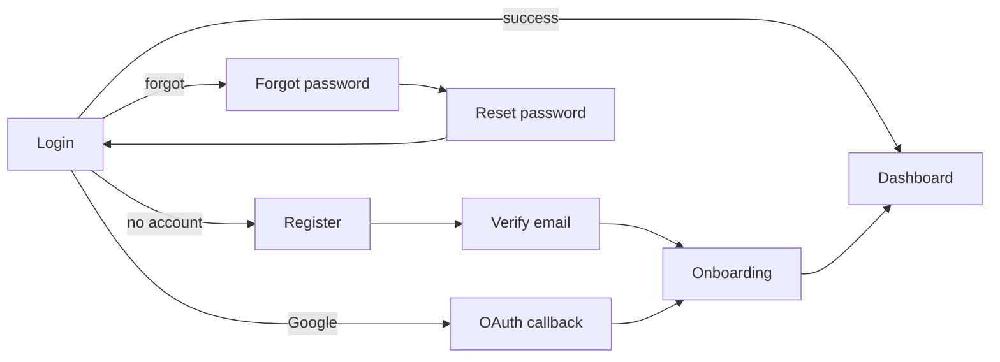

# Authentication & Authorization — Implementation Plan

> **Document 18 of 18** · Depends on: [17-auth-architecture](17-auth-architecture.md), [06-frontend-architecture](06-frontend-architecture.md), [16-sprint-plan](16-sprint-plan.md), [DESIGN.md](../DESIGN.md) · Decision: [ADR 0005](../.claude/docs/adr/0005-self-hosted-aspnet-identity-auth.md)

The build plan for the auth system designed in `docs/17`: folder structure (backend + frontend), feature-based frontend architecture, the Folio auth UI spec, the phased roadmap, and a ready-to-execute sprint/task breakdown mapped to acceptance criteria. **This is a design deliverable — no code is written yet.**

---

## 1. Backend folder structure (vertical slice)

Mirrors the existing Resume slice (CLAUDE.md §6); `<` new `>` marks additions.

```
backend/src/
  InterviewCopilot.Domain/
    Users/                                   < new aggregate
      ApplicationUser.cs                     < identity root (Id == owner_id)
      UserProfile.cs                         < 1:1 profile aggregate
      CareerProfile.cs  ResumeStatus.cs  Preferences.cs  NotificationSettings.cs   < value objects
      OnboardingProgress.cs                  < VO: 4 step flags + completedAt
      RefreshToken.cs  UserSession.cs  ExternalLogin.cs
      Roles.cs  Permissions.cs               < constants
      UserEvents.cs                          < UserRegistered, EmailVerified, ...
    Common/Identifiers.cs                    ~ add UserId, RefreshTokenId, UserSessionId
  InterviewCopilot.Application/
    Abstractions/
      Identity.cs                            < ITokenService, IIdentityService, IRefreshTokenStore,
                                               IPasswordResetService, IGoogleOAuthClient, IEmailSender
    Features/Auth/
      Register/            Register.cs                 (command + validator + handler + response)
      VerifyEmail/         VerifyEmail.cs
      ResendVerification/  ResendVerification.cs
      Login/               Login.cs
      RefreshToken/        RefreshToken.cs
      Logout/              Logout.cs   LogoutAll.cs
      ForgotPassword/      ForgotPassword.cs
      ResetPassword/       ResetPassword.cs
      ChangePassword/      ChangePassword.cs
      GoogleCallback/      GoogleCallback.cs
      LinkExternalLogin/   LinkExternalLogin.cs
      Sessions/            ListSessions.cs   RevokeSession.cs
    Features/Profile/
      GetMe/  UpdateProfile/  CompleteOnboardingStep/
    Common/Behaviors/
      AuthorizationBehavior.cs               < ownership + role/plan (DRY cross-cut)
  InterviewCopilot.Infrastructure/
    Identity/
      ApplicationIdentityUser.cs             < EF/Identity-facing user (maps to Domain)
      IdentityService.cs                     < wraps UserManager/SignInManager/RoleManager
      TokenService.cs                        < RS256 JWT issue + JWKS
      RefreshTokenStore.cs                   < hash, rotate, reuse-detect
      GoogleOAuthClient.cs                   < code exchange + profile
      SesEmailSender.cs
      PasswordPolicy.cs  BreachedPasswordChecker.cs   < HIBP k-anonymity
    Persistence/Configurations/
      UserConfiguration.cs  UserProfileConfiguration.cs
      RefreshTokenConfiguration.cs  UserSessionConfiguration.cs
      ExternalLoginConfiguration.cs  AuthAuditLogConfiguration.cs
    Migrations/  ~ <timestamp>_AddIdentityAndAuth.cs
  InterviewCopilot.Api/
    Endpoints/AuthEndpoints.cs  MeEndpoints.cs        < new groups
    Authentication/
      JwtBearerSetup.cs                      < replaces Dev bypass in all envs
      RefreshCookie.cs                       < __Host- cookie helpers
      SecurityHeadersMiddleware.cs
      RateLimitPolicies.cs                   < login/register/forgot/refresh buckets
    Program.cs  ~ wire bearer + cookie + policies + rate limiter

backend/tests/
  InterviewCopilot.Domain.UnitTests/Users/...
  InterviewCopilot.Application.UnitTests/Auth/...        < handler tests, faked ports (NSubstitute)
  InterviewCopilot.Integration.Tests/Auth/...            < API + Postgres (Testcontainers): register→verify→login→refresh→logout
  InterviewCopilot.Architecture.Tests/  ~ assert Auth slices obey dependency + naming rules
```

## 2. Frontend folder structure (feature-based)

Extends `docs/06`; auth is a self-contained feature module.

```
frontend/
  app/
    (auth)/                                  < route group: centered card layout, no app nav
      layout.tsx                             < AuthShell (logo, theme toggle, panel)
      login/page.tsx
      register/page.tsx
      forgot-password/page.tsx
      reset-password/page.tsx                ?token=...
      verify-email/page.tsx                  ?token=...
      callback/page.tsx                      < OAuth return: capture access, set state
    (app)/
      onboarding/page.tsx                    < 4-step wizard
      settings/security/page.tsx             < sessions + change password
    middleware.ts                            < route protection (refresh presence + redirects)
  features/auth/                             < feature module
    components/
      LoginForm.tsx  RegisterForm.tsx  ForgotPasswordForm.tsx  ResetPasswordForm.tsx
      VerifyEmailPanel.tsx  GoogleButton.tsx  PasswordStrength.tsx  AuthCard.tsx
    onboarding/
      OnboardingWizard.tsx  StepProfile.tsx  StepResume.tsx  StepRole.tsx  StepAnalysis.tsx
      OnboardingProgress.tsx
    sessions/SessionList.tsx
    hooks/
      use-auth.ts          < login/register/logout mutations (TanStack Query)
      use-session.ts       < GET /me, refetch on focus
      use-onboarding.ts
    lib/
      auth-api.ts          < typed client calls (generated types/api.d.ts)
      token-store.ts       < in-memory access token + refresh scheduler
    schemas.ts             < zod schemas mirroring backend validators
  stores/auth.store.ts     < Zustand: user, accessToken (memory), status
  components/providers/AuthProvider.tsx      < bootstraps session, silent refresh, context
  lib/api/client.ts        ~ attach Bearer, 401 → silent refresh → retry once → redirect
```

### 2.1 Session management on the client

`AuthProvider` calls `POST /auth/refresh` on mount (cookie present) to bootstrap an access token into memory, schedules a silent refresh ~60s before the 15-min expiry, and exposes `{ user, status, login, logout }` via context + `auth.store`. `apiClient` injects the Bearer header; on `401` it attempts one silent refresh then retries, else routes to `/login`. **No tokens in `localStorage`** (XSS posture, DESIGN/CLAUDE rules). `middleware.ts` guards `(app)` routes by refresh-cookie presence (cheap gate); the server `/me` call is the authoritative check.

## 3. Auth UI spec (Folio design system)

Style: **Claude / Linear / Notion** restraint — calm, content-first, no marketing hero, no large illustrations. Built on `DESIGN.md` tokens (warm paper, single bronze accent, Newsreader headings, Inter UI), Tailwind 4 + shadcn/ui, Framer Motion.

**Shared `AuthCard`/`AuthShell`:** centered single panel, max-width ~400px on `--background`; `.panel` surface (hairline border, `--shadow-sm`, inset top highlight); italic-serif **"ic"** monogram + page title (serif `text-h2`); theme toggle top-right; quiet footer links. Page enter = fade + 8px rise (180–240ms), reduced-motion aware.

| Page | Content |
|---|---|
| **Login** | Email + password (show/hide), "Forgot?" inline link, bronze-gradient **Sign in** (one primary/screen), `— or —` divider, **Continue with Google** ghost button, "Create account" link. Inline `aria-live` errors; generic credential error. |
| **Register** | Full name, email, password with live `PasswordStrength` meter (Folio `.meter`) + rule hints, Google option, terms note. Submit → "check your email" confirmation state. |
| **Forgot password** | Email field; always-success confirmation panel (no enumeration). |
| **Reset password** | New + confirm password, strength meter; success → CTA to Login. Invalid/expired token → friendly error + resend. |
| **Verify email** | Auto-verifies from `?token`; states: verifying (skeleton), success (→ onboarding), expired (resend button). |
| **Complete profile** (onboarding step 1) | Current position, years of experience, industry, preferred role; **Skip for now** ghost + **Save & continue** primary; step progress meter at top. |

**States are first-class** (DESIGN §7): every form ships loading (button spinner + disabled), inline field errors (`aria-live`), submit error (ProblemDetails `code` → friendly copy), success. **Accessibility:** labeled fields, visible `--ring` focus, full keyboard path, `prefers-reduced-motion`, ≥24px targets, announced errors. **Dark/light** via existing `theme.store` + Folio `.dark` tokens.



## 4. Phased roadmap

| Phase | Scope | Exit criteria |
|---|---|---|
| **P0 Foundation** | EF migration (Identity tables + `users` rename, profile, tokens, sessions, audit); `TokenService` (RS256+JWKS); JWT bearer replaces Dev bypass; `ICurrentUser` from real JWT | Migration applies; protected endpoint rejects anon; arch tests green |
| **P1 Email/password core** | Register, verify email, login, refresh (rotation), logout/-all; rate limits + lockout; SES email | AC: register/login/logout/refresh pass end-to-end (integration) |
| **P2 Password lifecycle** | Forgot/reset (revoke-all), change password, breached-password check | AC: reset works; old sessions invalidated |
| **P3 Google OAuth** | start/callback, provision, account linking, link endpoint | AC: Google sign-in + sign-up + link, no dup records |
| **P4 Profile & onboarding** | `/me`, profile update, onboarding steps + UI wizard | AC: profile persisted; resumable onboarding |
| **P5 RBAC & sessions UI** | Role/policy enforcement, seed roles, device/session manager, security settings page | Admin/premium policies enforced; sessions listable/revocable |
| **P6 Hardening** | Security headers/CSP, audit logging, key-rotation runbook, `/security-review` + pen-test pass | `docs/10` §10 + §9 gate green |

## 5. Sprint / task breakdown

Two 2-week sprints to production-ready (extends `docs/16`). Each task ships with tests in the same change (CLAUDE.md §4).

### Sprint A — Identity foundation & email/password (P0–P2)

| # | Task | Owner agent | AC link |
|---|---|---|---|
| A1 | Domain: `ApplicationUser`, `UserProfile` + VOs, `RefreshToken`, `UserSession`, `ExternalLogin`, events, IDs | `architect` + `backend` | Profile persisted |
| A2 | EF migration: Identity + `candidates`→`users`, profile, tokens, sessions, audit; configs; tenant filter intact | `backend` + `devops` | Profile persisted |
| A3 | `TokenService` (RS256, JWKS endpoint) + `RefreshTokenStore` (hash, rotate, reuse-detect) | `backend` | Refresh sessions |
| A4 | JWT bearer + `__Host-` refresh cookie wiring; remove Dev bypass; `ICurrentUser` from JWT | `backend` | Unauthorized blocked |
| A5 | Register + VerifyEmail + ResendVerification slices; SES sender; outbox email | `backend` + `ai-engineer`(prompts n/a) | Register |
| A6 | Login + Refresh + Logout + LogoutAll slices | `backend` | Login / Logout / Refresh |
| A7 | Forgot/Reset/Change password; revoke-all on reset; breached-password check | `backend` | Reset password |
| A8 | Rate-limit policies + Identity lockout on auth endpoints | `backend` + `devops` | Production-ready |
| A9 | Frontend: AuthShell, Login, Register, Forgot, Reset, Verify pages + forms (Folio) | `frontend` | Register/Login |
| A10 | `AuthProvider` + token-store + silent refresh + apiClient 401 retry + middleware guard | `frontend` | Unauthorized blocked |
| A11 | Tests: domain unit, handler unit (faked ports), integration journey (Testcontainers), component (MSW) | `tester` | All |

### Sprint B — Google, profile/onboarding, RBAC, hardening (P3–P6)

| # | Task | Owner agent | AC link |
|---|---|---|---|
| B1 | `GoogleOAuthClient`; start/callback slices with state+PKCE | `backend` | Google login |
| B2 | Provisioning + account linking (verified-email keyed); link endpoint | `backend` | Google login (no dups) |
| B3 | Google button + `/auth/callback` page + link UI in settings | `frontend` | Google login |
| B4 | `/me`, profile update, onboarding step slices | `backend` | Profile persisted |
| B5 | Onboarding wizard (4 steps, skippable, progress meter) | `frontend` | Onboarding |
| B6 | Roles/permissions, policies, `AuthorizationBehavior` ownership, role seeding | `backend` + `architect` | Unauthorized blocked |
| B7 | Sessions/device manager + security settings page | `frontend` + `backend` | Logout (device/all) |
| B8 | Security headers/CSP middleware, `auth_audit_logs`, JWKS rotation runbook | `devops` + `reviewer` | Production-ready |
| B9 | `/security-review` + `/deploy-checklist`; update `docs/10` gate; OpenAPI regen + typed client | `reviewer` + `devops` | Production-ready |
| B10 | E2E (Playwright): signup→verify→onboarding→protected; Google; reset; logout-all | `tester` | All |

### Definition of done (per CLAUDE.md §4–6)

Vertical slice with ports wired in Infrastructure and exposed via an endpoint group · unit + integration/component tests to 80%+ on Domain/Application · docs/ADR/OpenAPI updated in the same change · `/code-review` clean · `/deploy-checklist` before release · arch tests green.

## 6. Risks & mitigations (auth-specific; extends `docs/13`)

| Risk | Mitigation |
|---|---|
| Owning password storage / token signing | ASP.NET Identity hasher; keys in Secrets Manager; JWKS rotation; gitleaks gate |
| Refresh-token theft | Hash-at-rest, rotation, reuse-detection revokes chain, `__Host-`/httpOnly/Secure/SameSite |
| Account-linking hijack | Link only on verified email; defer for unverified password accounts |
| `candidates`→`users` migration risk | Expand/contract (`docs/04` §6); `id` preserved so `owner_id` FKs unaffected; one-shot migration task before traffic |
| No MFA at launch (vs managed IdP) | Roadmap item post-P6; lockout + breached-password + rate limits cover launch |
| Email deliverability for verify/reset | SES with SPF/DKIM/DMARC; resend flow; monitored bounce/complaint rates |
```

